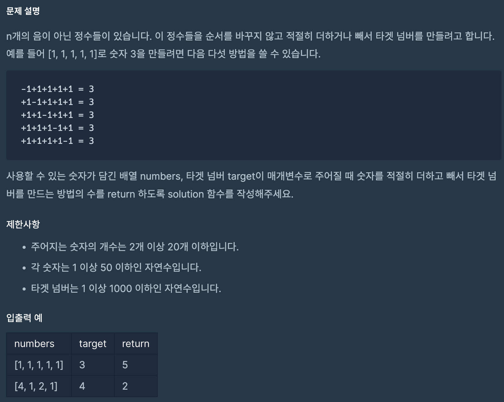

# 타겟 넘버
## programmers

문제
---


이 문제는 주어진 숫자들을 + , - 만 바꿔서 연산해

targetnumber에 맞는 경우의 수를 세는 문제이다.

중요한 것은 숫자의 위치가 바뀌지 않고서 그대로 연산하는 것인데,

tree가 떠올랐다. 0에서 시작하여 주어진 numbers의 순서대로 

 +와 -의 경우 두가지로 나누어 나가는 tree를 떠올려서 문제를 해결했다 


                     0                   //0에서 시작해서


              +[0]        -[0]          //numbers의 [0]부터 +와 -의 경우를 


           +[1]  -[1]  +[1]  -[1]       //가지치기 하면서 target 넘버를 만드는 경우의 수를 찾는 이미지가 떠올랐다
              


그래서 dfs의 방법처럼 모든 경우의 수를 따져보고 target이 만들어지는 경우의 수를 세는 방식으로 풀었다.


```
class TargetNumber {
    int count = 0;
    public int solution(int[] numbers, int target) {
        dfs(numbers, 0, target, 0);
        int answer = count;
        
        return answer;
    }
    public void dfs(int[] numbers, int index, int target, int result){
        if(index == numbers.length){
            if(result == target){
                count++;
            }
            return;
        }
        int add = result + numbers[index];
        int sub = result - numbers[index];
        dfs(numbers, index +1, target, add);
        dfs(numbers, index +1, target, sub);
    }
}
```
