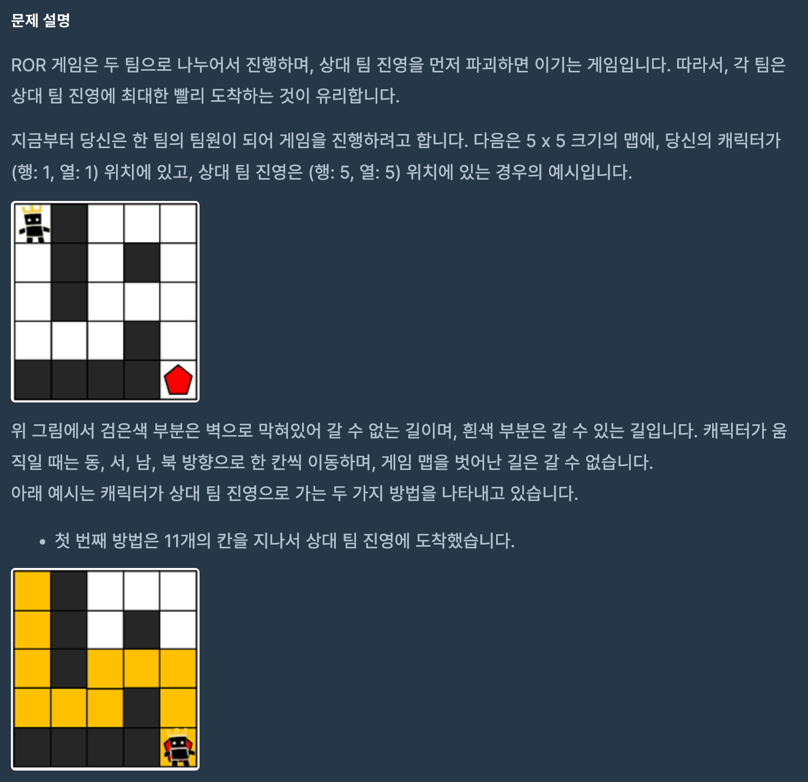
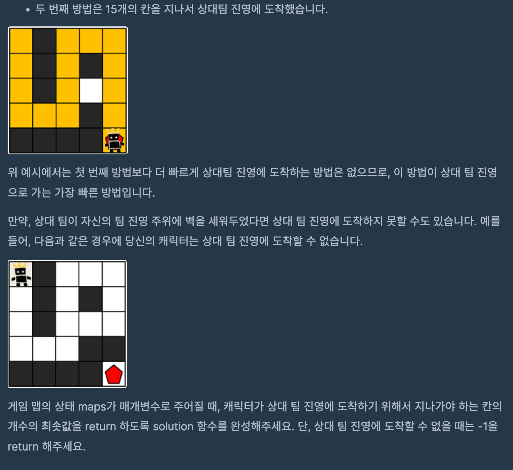

# 게임 맵 최단거리
## programmers

문제
---




이 문제는 상대 진영에 도달하는 가장 빠른 경로를 찾는 문제이다.

문제를 보고 dfs, bfs 방법이 떠올랐는데, 

최소 경로이다 보니 bfs를 선택해서 풀었다.

maps와 같은 크기인 visit을 만들어서

한 칸을 움직이면 움직이기 전에 칸의 숫자를 +1 해줘서 움직인 칸을 카운트했다.

상 하 좌 우 중에서 maps 범위 안에 있고, visit의 값이 0 인 곳의

좌표를 Queue 형인 next에 넣어서 next에 다음 이동 할 칸이 없을 때까지 진행해서

visit의 적 위치 인덱스에 최단 거리 값을 저장 하도록 하였다.

처음에는 양갈래 길이 나오면 어떻게 진행 되는지 이해가 안되서 시간이 걸렸는데,

양갈래 길부터는 이동하는 플레이어가 복제되어서

각자 한 칸씩 진행(Queue형이므로 먼저온것 부터 진행한다) 하는 것으로 이해했다.


```
import java.util.*;
class Solution {
         
        int[] dx ={0, 0, 1, -1};
        int[] dy ={1, -1, 0, 0};
    
    public int solution(int[][] maps) {

        int[][] visit = new int[maps.length][maps[0].length];
        
        bfs(maps, visit);
        int answer = visit[maps.length - 1][maps[0].length - 1];
        if(answer == 0 ) return -1;
        
        return answer;
    }
    
    public void bfs(int[][] maps, int[][] visit){
        
        Queue<int[]> next = new LinkedList<>();
        next.add(new int[]{0,0});
        visit[0][0]=1;
        
        int count = 0;
        while(!next.isEmpty()){
            int[] temp = next.poll();
            int x = temp[0];
            int y = temp[1];
            
            for(int i = 0; i < 4; i++){
                int mx = x + dx[i];
                int my = y + dy[i];
                
                if(mx < 0 || mx > maps.length - 1 || my < 0 || my > maps[0].length - 1) continue;
                if(visit[mx][my] == 0 && maps[mx][my] == 1){
                    visit[mx][my] = visit[x][y] +1;
                    next.add(new int[] {mx,my});
                }
            }
        }
    }
}
```
