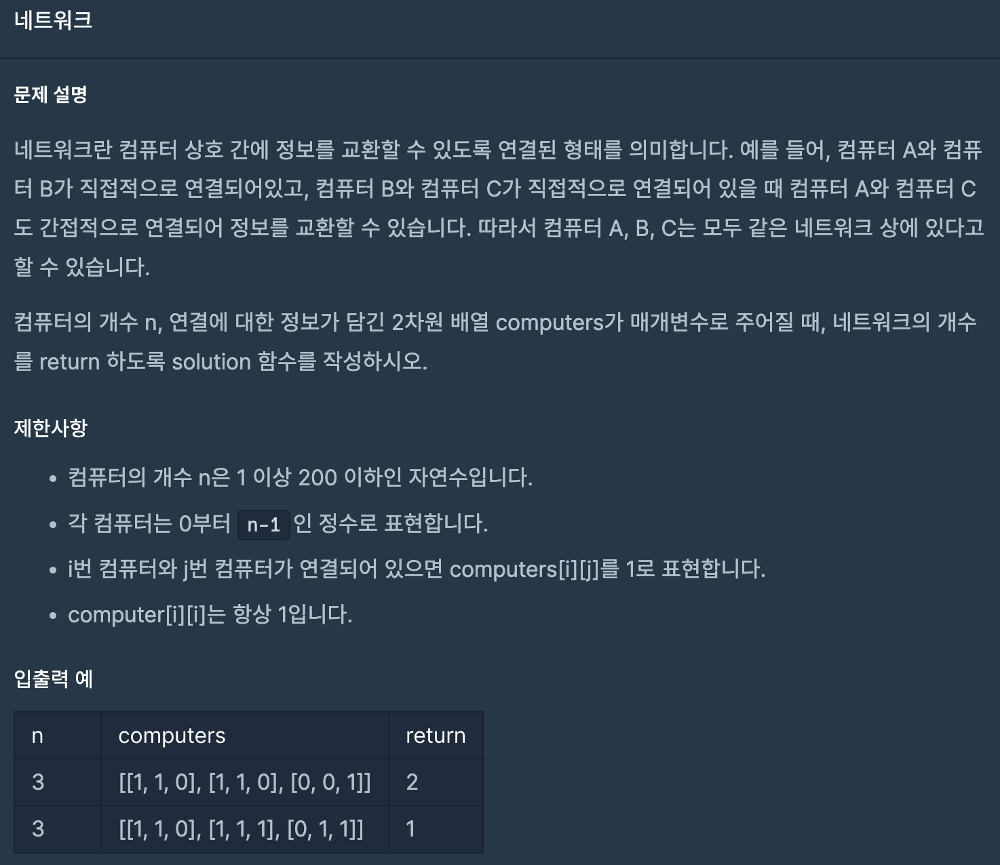
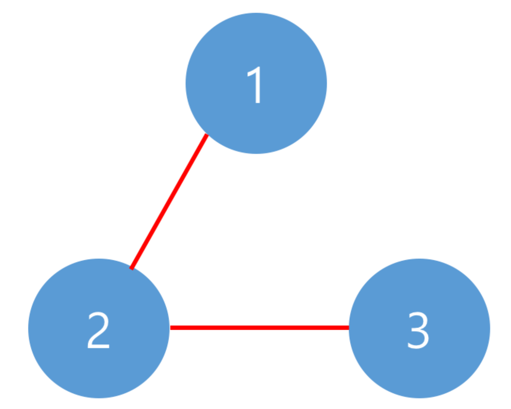
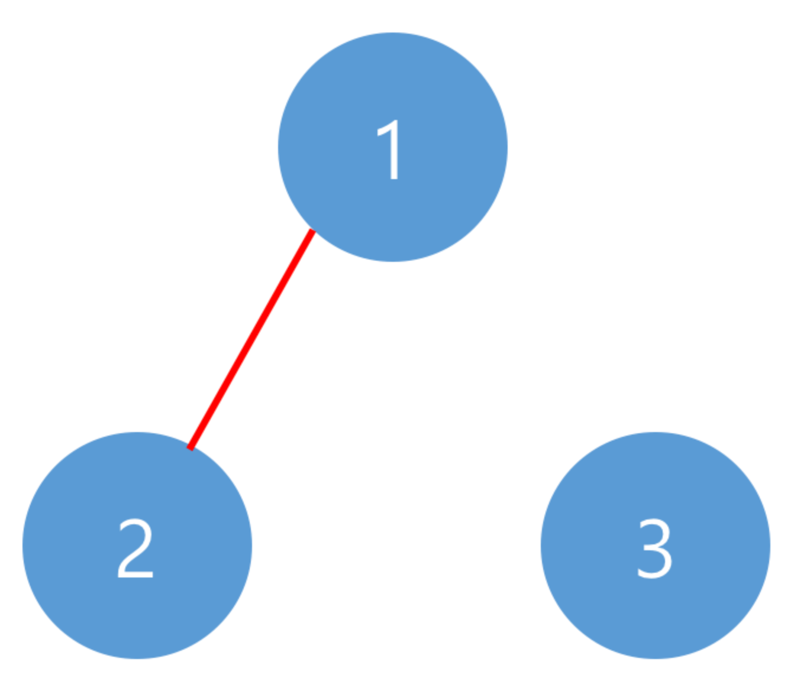

# 네트워크
## programmers

문제
---


이 문제는 컴퓨터간의 연결된 네트워크 수를 구하는 문제이다.

```computers```가 주어져서 각 컴퓨터 간의 연결 유무를 알 수 있기 때문에

각 컴퓨터를 방문해서 연결유무를 파악하도록 ```dfs```의 방법으로 접근했다. 

```dfs```에서는 한 컴퓨터를 방문하면 연결된 다른 컴퓨터를 방문하도록 

재귀 방법으로 ```dfs```를 실행시켰다.

또한,  ```for```문을 돌려서 

방문 처리가 안되어 있는 컴퓨터가 있으면 방문하도록 하였다





```
import java.util.*;

class Solution {

  static boolean[] visit;

  static void dfs(int[][] computers, int i, int n) {
    visit[i] = true;

    for (int j = 0; j < n; j++) {
      if (visit[j] == false && computers[i][j] == 1) {
        dfs(computers, j, n);
      }
    }
  }

  public int solution(int n, int[][] computers) {
    int answer = 0;
    visit = new boolean[n];

    for (int i = 0; i < n; i++) {
      if (visit[i] == false) {
        answer++;
        dfs(computers, i, n);
      }
    }
    return answer;

  }
}

```
