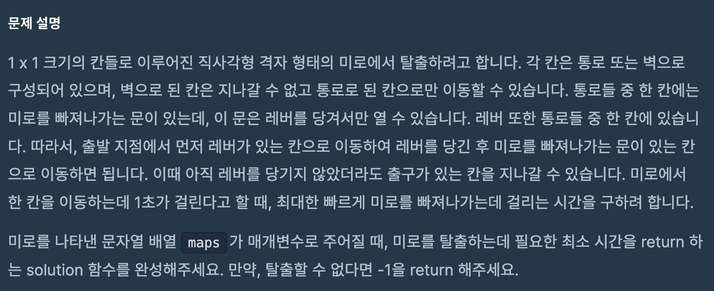
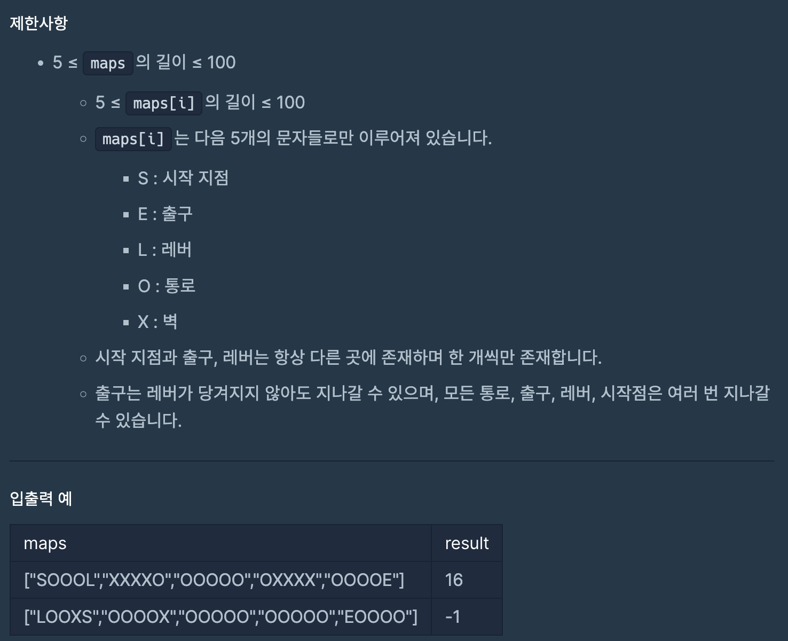
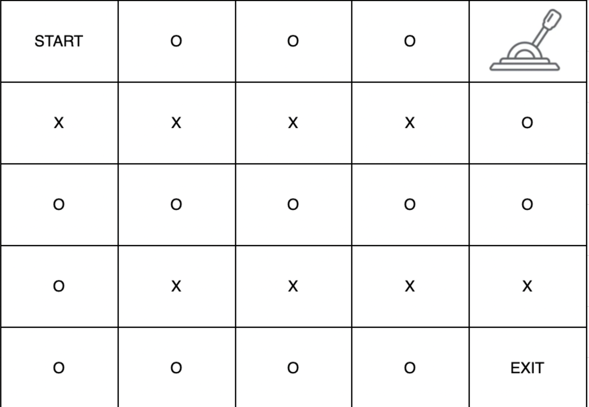
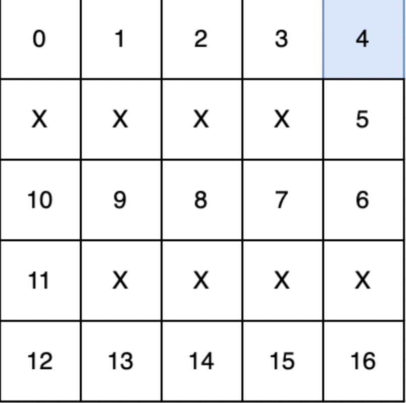

# 네트워크
## programmers

문제
---




이 문제는 직사각형 형태의 미로에서 레버칸에 먼저 방문 후


출구에 방문해서 미로를 탈출하는 문제이다. 


각 칸을 방문하는데 걸리는 시간은 1초이며,


출발지 -> 레버 -> 출구 순으로 가는데 걸리는 최소의 시간을 구하는 문제이다.


```maps```는 문자열 배열로 주어지며 ```maps[i]```는 5개의 문자로만 이루어진다.


아래와 같이 진행 되며 탈출할 수 없다면 -1을 return 한다.

따라서 ```bfs```로 문제를 해결 하였다.






```
import java.util.*;

class Solution {
  static String[][] miro;
  static int[] dx = { 0, 0, -1, 1 };
  static int[] dy = { 1, -1, 0, 0 };

  public static int bfs(int[] start, String target, boolean[][] visit) {
    Queue<int[]> que = new LinkedList<>();
    que.add(new int[] { start[0], start[1], 0 }); //x, y, count
    visit[start[0]][start[1]] = true;

    while (!que.isEmpty()) {
      int[] temp = que.poll();
      int x = temp[0];
      int y = temp[1];
      int count = temp[2];

      for (int i = 0; i < 4; i++) {
        int mx = x + dx[i];
        int my = y + dy[i];

        if (mx < 0 || mx >= miro.length || my < 0 || my >= miro[0].length) 
          continue;
        if (!visit[mx][my] && !miro[mx][my].equals("X")) {
          visit[mx][my] = true;
          que.add(new int[] { mx, my, count + 1 });
          if (miro[mx][my].equals(target)) {
            return count + 1;
          }
        }
      }
    }
    return -1;
  }

  public int solution(String[] maps) {
    int n = maps.length;
    int m = maps[0].length();
    miro = new String[n][m];
    boolean[][] visit = new boolean[n][m];

    int[] start = new int[2];
    int[] lever = new int[2];

    for (int i = 0; i < n; i++) {
      for (int j = 0; j < m; j++) {
        miro[i][j] = Character.toString(maps[i].charAt(j));
        if (miro[i][j].equals("S")) {
          start[0] = i;
          start[1] = j;
        } else if (miro[i][j].equals("L")) {
          lever[0] = i;
          lever[1] = j;
        }
      }
    }

    int first = bfs(start, "L", visit);
    visit = new boolean[n][m];

    int second = bfs(lever, "E", visit);
    if (first == -1 || second == -1)
      return -1;
    return first + second;
  }
}

```
