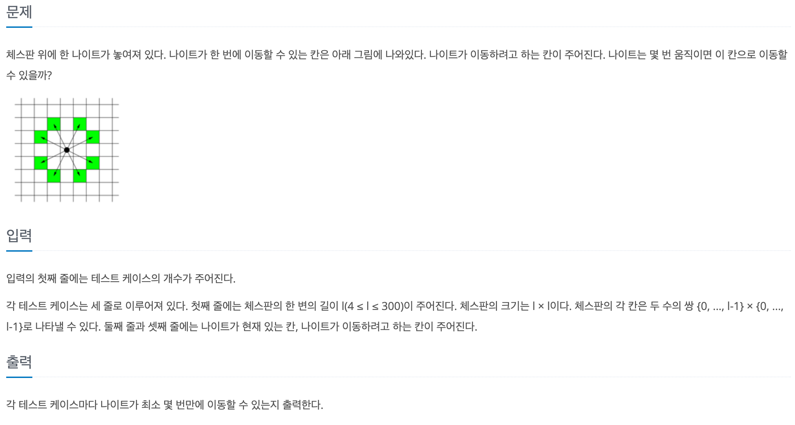

# 나이트의 이동

## baekjoon 7562

## 문제




이 문제는 체스판에서 나이트가 ```target```까지 이동하기 위해 


몇 번을 움직여야 하는지를 최소값으로 구하는 문제이다


따라서  ```bfs```로 문제를 풀었다


```
import java.util.*;

public class 7562{
    static int[] dx = {1, 2, 2, 1, -1, -2, -2, -1};
    static int[] dy = {2, 1, -1, -2, -2, -1, 1, 2};
    static boolean[][] visit;

    public static void main (String[] args){
        Scanner sc = new Scanner(System.in);
        int T = sc.nextInt();

        for(int i = 0; i < T; i++){
            int L = sc.nextInt();
            visit = new boolean[L][L];

            int[] start = {sc.nextInt(), sc.nextInt(), 0};  // x, y, count
            int[] target = {sc.nextInt(), sc.nextInt()};

            System.out.println(bfs(start, target, L));
        }
    }

    public static int bfs(int[] start, int[] target, int L){
        Queue<int[]> que = new LinkedList<>();
        que.add(start);

        while(!que.isEmpty()){
            int[] temp = que.poll();
            int x = temp[0];
            int y = temp[1];
            int count = temp[2];

            if(x == target[0] && y == target[1]) return count;

            for(int i = 0; i < 8; i++){
                int mx = x + dx[i];
                int my = y + dy[i];

                if(mx < 0 || mx >= L || my < 0 || my >= L) continue;
                if(!visit[mx][my]){
                    visit[mx][my] = true;
                    que.add(new int[]{mx, my, count + 1});
                }
            }
        }

        return -1;
  }
}

```
