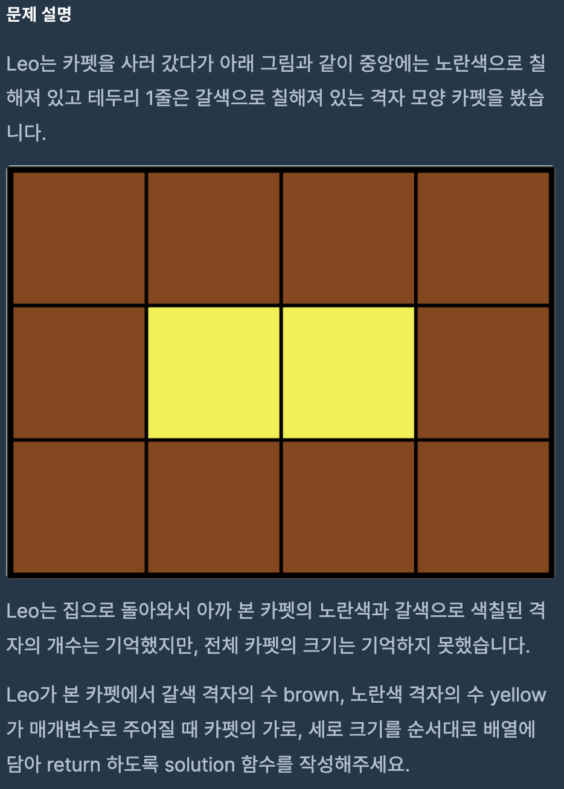
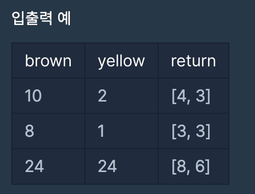

# 카펫

## programmers

## 문제





이 문제의 핵심은

`brown`의 가로, 세로의 길이는

`yellow`의 가로, 세로의 길이에 +2를 해준 값이다.

따라서 `yellow`값으로 가로 세로의 쌍을 구하여

그 쌍이 `brown`값을 만족하는지만 보면 된다.

그래서 처음에는 ```Queue```를 이용해서 

`yellow`의 가로 세로 쌍을 저장하고

하나씩 `brown`의 조건에 맞는지 검사해서 아래와 같이 `return` 했는데,

뭔가 과한? 느낌이 들어서 `Queue`를 사용하지 않고 가로 세로 쌍을 구하면

바로 `brown`의 조건에 맞는지 검사해서 return 하도록 새로 풀었다


# 1
---
```

import java.util.*;

class Solution {
  public int[] solution(int brown, int yellow) {
    Queue<int[]> xy = new LinkedList<>();
    int temp = 1;

    if (yellow == 1)  
      return new int[] { 3, 3 };
    while (temp <= yellow / 2) {
      if (yellow % temp == 0) {
        xy.add(new int[] { temp, (yellow / temp) });
      }
      temp++;
    }

    int[] answer = new int[2];
    while (!xy.isEmpty()) {
      int[] test = xy.poll();
      if (test[0] + test[1] == brown / 2 - 2) {
        answer[0] = test[1] + 2; 
        answer[1] = test[0] + 2;
        break;
      }
    }
    return answer;
  }
}
```
---
# 2
```

class Solution {
  public int[] solution(int brown, int yellow) {

    for (int height = 1; height <= yellow; height++) {
      if (yellow % height == 0) {
        int width = yellow / height;

        if (2 * width + 2 * height + 4 == brown) {
          return new int[] { width + 2, height + 2 };
        }
      }

    }

    return new int[] {};
  }
}
```
