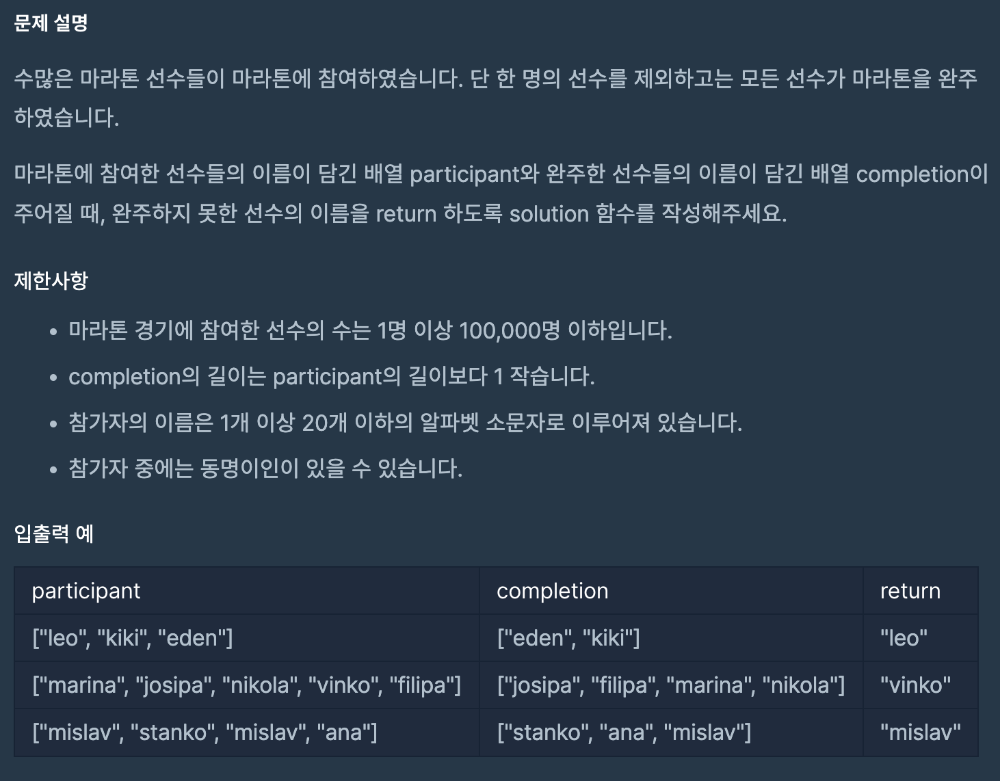

# 완주하지 못한 선수

## programmers

## 문제




이 문제는 `participant`로 주어진 선수의 이름과 `completion`이름을 비교해서 

`completion`에 없는 이름을 구하는 문제이다.

`HashMap`을 이용해서 `participant`의 이름을 `key`로 이름의 개수를 `value`로 저장하여

`completion`에 저장된 이름들을 `map`에서 `value` 값을 1씩 빼줘서,

`value`값이 0 이 아닌 `key`를 반환 했다. 

`completion`의 길이가 `participant`의 길이보다 1이 작으므로 

선수가 한명 남아서 비교적 쉽게 답을 구했다.

정렬로 풀수 있던데 다음기회에 업데이트 해보겠다.

```
import java.util.*;

class Solution {
  public String solution(String[] participant, String[] completion) {
    String answer = "";
    HashMap<String, Integer> map = new HashMap<>();
    for (String player : participant) {
      map.put(player, map.getOrDefault(player, 0) + 1);
    }

    for (String complete : completion) {
      map.put(complete, map.get(complete) - 1);
    }
    for (String key : map.keySet()) {
      if (map.get(key) > 0) {
        answer = key;
        break;
      }
    }

    return answer;
  }
}
```