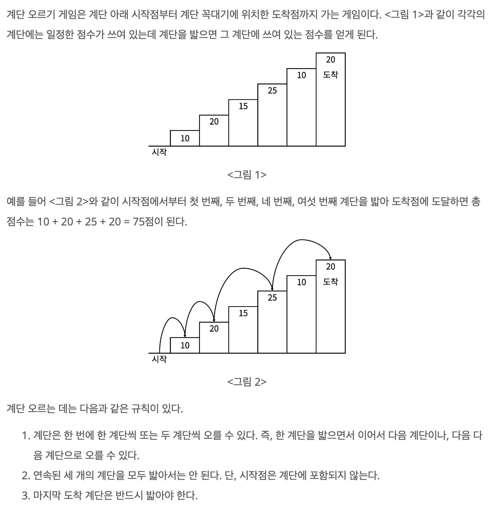

# 계단 오르기

## baekjoon 2579

## 문제



이 문제는 정해진 규칙에 따라 계단을 밟으면서 도착 지점까지 최대 점수를 얻는 문제이다.

따라서, 이전에 결과가 현재의 결과에 영향을 주기 때문에 전체 문제를 해결하기 위해 


부분 문제로 쪼개어서 풀고 다시 전체 문제를 푸는 방식인 DP로 문제를 해결했다.

 그러기 위해서 점화식을 구해서 풀어야 하는데 생각해내기 매우 힘들었다.

문제의 핵심은 '**도착 지점의 계단은 무조건 밟아야 하며,연속 3계단은 밟지 못한다**'는 점이다.

 전체 문제를 쪼개서 처음 계단을 밟는 과정을 생각해 보면, 처음 3계단의 점수는 어느 정도 결정 지을 수 있다. 
 

`point[1]`은 처음 계단의 점수이고, `point[2]`는 처음 두 계단 점수의 합이며,

`point[3]`은 `stair[3]`의 점수에 `stair[1]`과 `stair[2]` 중에 더 큰점수를 합한 값이다.

이후의 계단은 
| n-3 | n-2 | n-1 | n |
|------|------|------|------| 

도착 지점이 n인 칸에서 마지막 4칸을 보면, 점수를 구하는 방법은 2가지이다.


[n-3]에서 출발해 [n-1]을 밟고 [n]에 도착하는 경우와 

[n-2]에서 출발해 [n]에 도착하는 경우이다.

[n-3]과 [n-2]로 오는 과정에서 점수들은 `point[n-3]` `point[n-2]`에 저장 되어 있고,

마지막 [n-1]의 점수에 따라 [n]에 도착하는 최대 점수가 달라지는 경우이다.

따라서 점화식은 `point[n] = stair[n] + Math.max(point[n-3] + stair[n-1], point[n-1])`이다.


```
import java.util.*;

public class 2579 {
  public static void main (String[] args) {
        Scanner sc = new Scanner(System.in);
        int num = sc.nextInt();
        int[] stair = new int[num + 1];

        for(int i = 1; i <= num; i++){
            stair[i]=sc.nextInt();
        }
        
        int[] point = new int[num + 1];
        point[1] = stair[1];
        
        for(int n = 2; n <= num; n++){
            if(n==2){ 
              point[2] = stair[2] + stair[1];
              }
            else if(n==3){
               point[3] = stair[3] + Math.max(stair[1], stair[2]);
            } else {
               point[n] = stair[n] + Math.max(point[n-3] +stair[n-1], point[n-2]);
            }
        }
        System.out.println(point[num]);
    }
  
}


```
