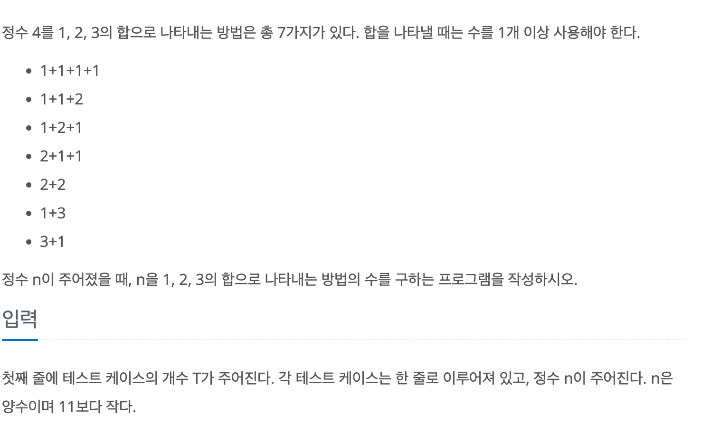

# 1,2,3 더하기

## baekjoon 9095

## 문제



이 문제는 주어진 수를 **1,2,3**의 합으로 나타낼 수 있는 경우의 수를 구하는 문제이다.

전체 문제를 풀기 위해 세부 문제로 나누어서 문제를 푸는 DP로 문제를 풀었다.

**1**은 1로 나타내고, **2**는 1+1, 2 두가지로 나눌수 있고

**3**은 1+1+1, 1+2, 2+1, 3 네가지 경우로 나눌수 있다. 

문제에서 예시로 준 **4**는 1+1+1+1, 1+1+2, 1+2+1, 2+1+1, 2+2, 1+3, 3+1 일곱개의 경우로 나눌 수 있다.

**4**의 경우를 더해지는 마지막수로 정렬 해보면 이와같다.

1+1+1+1  

1+2+1    

2+1+1

3+1  -------> 3을 나타내는 경우에 +1

1+1+2

2+2 -------> 2를 나타내는 경우에 +2

1+3 ------->  1을 나타내는 경우에 +3

이걸로 알 수 있는 점은 **n**을 1,2,3의 합으로 나타 내는 것은 

**n-1**을 1,2,3의 합으로 나타내는 경우에 +1을 한 것과 **n-2**을 1,2,3의 합으로 나타내는 경우에 +2을 한 경우에

**n-3**을 1,2,3의 합으로 나타내는 경우에 +3을 한 것을 더하면 **n**을 1,2,3의 합으로 나타내는 경우와 같다는 것이다.

따라서 점화식은 `case[n] = case[n-1]+case[n-2]+case[n-3]`이가 된다.


이를 이용해 문제를 풀 수 있다.


```
import java.util.*;

public class 9095{
    public static void main(String[] args){
        Scanner sc = new Scanner(System.in);
        
        int T = sc.nextInt();
        int[] case = new int[11];
            case[1] = 1;
            case[2] = 2;
            case[3] = 4;

        for(int i = 0; i < T; i++){
            int n = sc.nextInt();
            
            for(int j =4; j <= n; j++){
                case[j] = case[j-1]+case[j-2]+case[j-3];
            }
            System.out.println(sum[n]);
            
        }
    }
}


```
