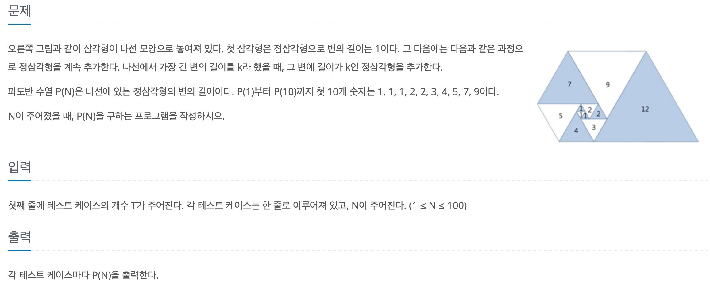

# 파도반 수열

## baekjoon 9461

## 문제




<small>출처 - [파도반 수열](http://terms.naver.com/entry.naver?docId=5702822&cid=60205&categoryId=60205)</small>


이 문제를 처음 봤을때 무슨 말인지 이해를 못했다.

처음 보는 개념이기도 했고 문제 설명이 좀 부족하다고 느꼇다.

그래서 네이버에 검색을 해서 보니 위에 그림과 함께 설명이 나와 있었다.

>변의 길이가 1인 정삼각형을 하나 그리자. 시계 방향으로 이동하면서 기존 삼각형들과 밑변을 공유하는 새로운 정삼각형을 그린다. 이런 과정을 반복할 때 그림에 새롭게 추가되는 꼭짓점은 나선을 그리게 될 것이다. 이 그림에 등장하는 정삼각형들의 변의 길이는 파도반 수열이라 불리는 수열을 이룬다.

처음에는 저 그림을 보고 점화식이 바로 떠올라서 개념을 읽지 않고 문제를 풀었다. 

첫 3개의 항은 변의 길이가 1이고 그 다음 부터 항은 점화식을 구해서 풀 수 있다.

 `P[N] = P[N - 2] + P[N - 3]`으로 다른 dp문제의 점화식보다 구하는게 쉬워서 

기분 좋게 제출 했지만 오류가 계속 발생했다. 알고 보니 `int[] P`를 사용 했는데,

`N`이 100까지 입력 될수 있어서 int 범위를 넘어서서 `long[] P`을 사용 해야 했다.


```
import java.util.*;

public class 9461 {
  public static void main(String[] args) {
    Scanner sc = new Scanner(System.in);

    int T = sc.nextInt();
    for (int i = 0; i < T; i++) {
      int N = sc.nextInt();
      if (N < 4) {
        System.out.println("1");
      } else {
        long[] P = new long[N + 1];
        P[1] = 1;
        P[2] = 1;
        P[3] = 1;

        for (int j = 4; j <= N; j++) {
          P[j] = P[j - 2] + P[j - 3];
        }
        System.out.println(P[N]);
      }
    }

  }
}

```
