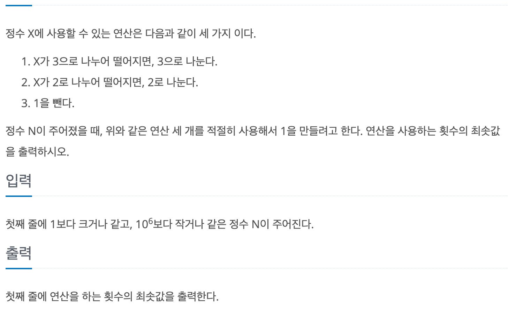
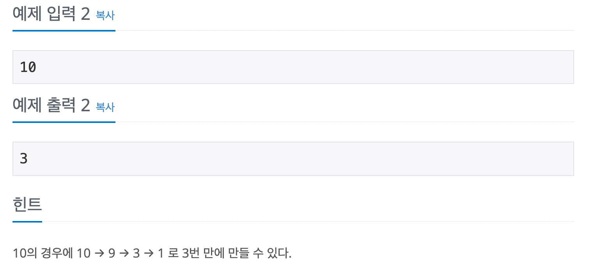

# 1로 만들기

## baekjoon 1463

## 문제





이 문제는 정수 X에 다음과 같은 3가지 연산을 이용하여

 1로 만드는데 사용하는 연산 횟수의 최솟값을 구하는 문제이다.

1. X가 X가 3으로 나누어 떨어지면, 3으로 나눈다.
2. X가 2로 나누어 떨어지면, 2로 나눈다.
3. 1을 뺀다.

dp의 방법으로 풀었는데 기본적인 점화식은 연산의 조건에 맞게 구할 수 있다.

모든 X에 사용 가능한 1을 빼는 연산인 

`dp[i] = dp[i - 1] + 1`을 기본으로 하고,

2나 3으로 나누어 떨어지면 

`Math.min(dp[i], dp[i / 2 or 3] + 1)`을 이용해 최소값을 구한다.


---

```
import java.util.*;

public class 1463 {
  public static void main(String[] args) {
    Scanner sc = new Scanner(System.in);
    int N = sc.nextInt();
    int[] dp = new int[N + 1];

    for (int i = 2; i <= N; i++) {
      dp[i] = dp[i - 1] + 1;
      if (i % 2 == 0) {
        dp[i] = Math.min(dp[i], dp[i / 2] + 1);
      }
      if (i % 3 == 0) {
        dp[i] = Math.min(dp[i], dp[i / 3] + 1);
      }
    }

    System.out.println(dp[N]);
  }
}
``````