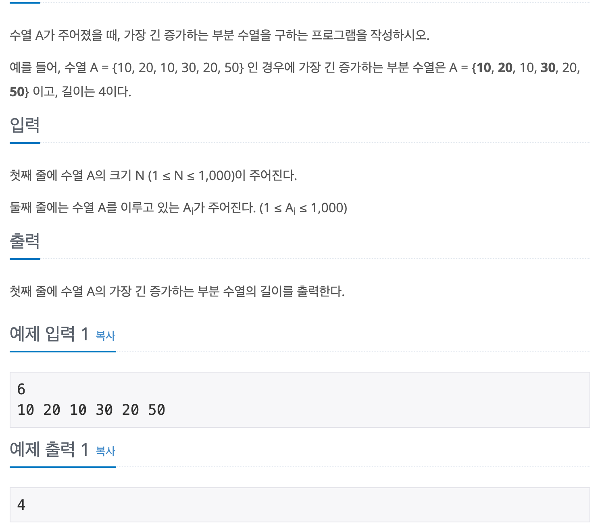

# 가장 긴 증가하는 부분 수열

## baekjoon 11053

## 문제




이 문제는 수열이 주어지면 수열내 가장 긴 부분 수열의 길이를 구하는 문제이다.

`A`와 같은 길이의 배열 `length`를 이용해 각 인덱스를 방문해 최대 길이를 `length`에 업데이트한다.

업데이트 방식은 `i`를 기준으로 각 인덱스를 방문해서 `A[i]`보다  `A[j]`가 크면

 `length[j]` `length[i] + 1` 중 큰값을 넣어준다.

 아래의 표는 1로 초기화된 `length`로 기준값인 `i`를 증가시키면서 업데이트를 진행한 표이다.


 |i|10|20|10|30|20|50 |
|:-:|:-:|:-:|:-:|:-:|:-:|:-:|
||1|1|1|1|1|1|
|0|1|2|1|2|2|2| 
|1|1|2|1|3|2|3|
|2|1|2|1|3|2|3|
|3|1|2|1|3|2|4|
|4|1|2|1|3|2|4|
|5|1|2|1|3|2|4|

따라서 수열 `A`의 가장 긴 증가하는 부분 수열의 길이는 `5`이다.


```
import java.util.*;

public class 11053 {
  public static void main(String[] args) {
    Scanner sc = new Scanner(System.in);

    int N = sc.nextInt();

    int[] A = new int[N];
    int[] length = new int[N];
    for (int i = 0; i < N; i++) {
      A[i] = sc.nextInt();
      length[i] = 1;
    }

    for (int i = 0; i < N; i++) {
      for (int j = i + 1; j < N; j++) {
        if (A[i] < A[j]) {
          length[j] = Math.max(length[j], length[i] + 1);
        }
      }
    }
    int max = 0;
    for (int len : length) {
      if (max < len){
        max = len;
      }
    }
    System.out.println(max);
  }
}
```