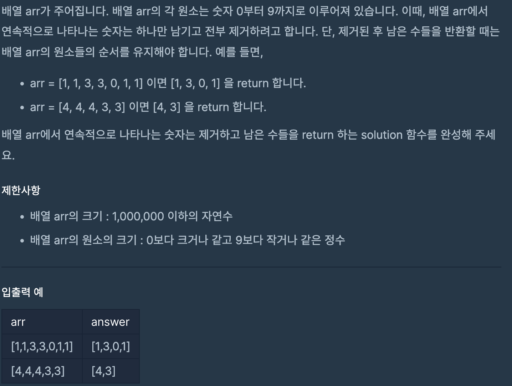

# 같은 숫자는 싫어

## programmers

## 문제



이 문제는 배열 `arr`에서 연속적으로 나오는 숫자를 하나만 남기면서 

순서대로 return 해야 하는 문제이다.

이번주 스터디의 주제가 `Stack`이라  `Stack`으로 해결했다.

`Stack`에 `arr`의 숫자를 하나씩 `push` 해주고 

`cur`을 이용해 연속으로 오는 수는 한 번만 `push` 되도록 하여 문제를 풀었다.


```
import java.util.*;

public class Solution {
  public int[] solution(int[] arr) {

    int cur = -1;
    Stack<Integer> stack = new Stack<>();
    for (int i = 0; i < arr.length; i++) {
      if (cur == arr[i])
        continue;
      stack.push(arr[i]);
      cur = arr[i];
    }
    int[] answer = new int[stack.size()];
    for (int j = stack.size() - 1; j >= 0; j--) {
      answer[j] = stack.pop();
    }
    return answer;
  }
}
```