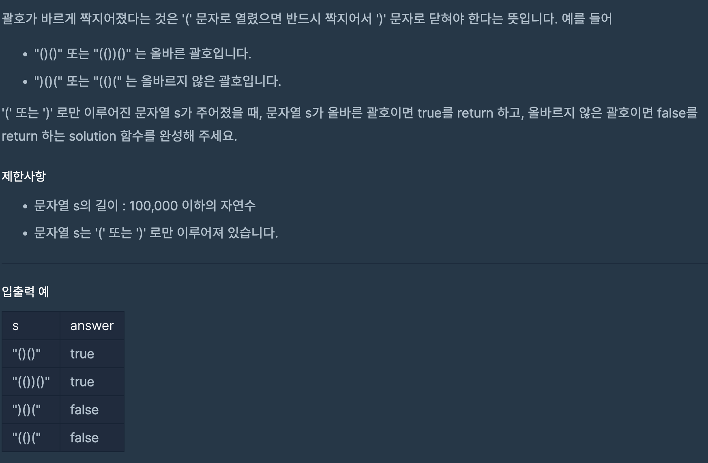

# 올바른 괄호

## programmers

## 문제



이 문제는 괄호가 올바르게 짝지어졌다는 것을 판별하는 문제이다.

`Stack`에 `(` `)`로만 이루어진 `s`를 하나씩 쪼개어

 `(`이면 `push`했고, `)`이면 `pop`해서 괄호를 짝지어 주었다.


`Stack`에 무언가 남아있으면 `(`가 짝을 못 만났다는 것이기 때문에,

`false` 해주고,  `(`가 없는 상태에서 `)`를 만나도 `false`처리했다.


```
import java.util.*;

class Solution {
  boolean solution(String s) {
    boolean answer = true;

    Stack<Character> stack = new Stack<>();

    for (char c : s.toCharArray()) {
      if (c == '(') {
        stack.push(c);
      } else {
        if (stack.empty()) {
          return false;
        } else {
          stack.pop();
        }
      }
    }

    return stack.empty();
  }
}
```