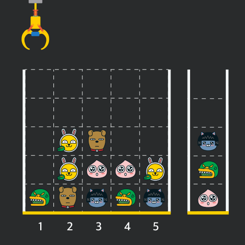

# 크레인 인형 뽑기 게임

## programmers

## 문제



이 문제는 `board` : N x N크기 격자의

각 열에 가장 아래 칸부터 인형들이 쌓여 있어서, 

각 열에 가장 위에 있는 인형을 뽑아서 바구니에 쌓는다.

바구니에 같은 인형이 연속 → 폭파되면서 사라지고,

바구니의 크기는 모든 인형들이 들어갈 정도로 크다.

이 조건에서 폭파된 인형 개수를 구하는 문제이다.

### 풀이

----


인형을 뽑아서 바구니에 담는 것이기 때문에 

데이터의 삽입,삭제가 한 곳에서 이뤄지고 순서가 중요하다고 생각해서 

Stack을 이용해서 문제를 풀었다.

`101`이라는 의미없는 데이터를 넣어서

`stack`에서 연속된 인형인지를 검사하는 부분에 

스택이 비어 있는지 검사하는 부분을 대신했다.

매번 인형을 넣을때마다 peek을 통해서 연속된 인형인지 검사 후

연속된 인형이면 `pop`을 통해 데이터(인형)을 제거하고 `count`에 +2 해주었으며,

`board`에도 인형이 있던 자리에 0을 넣어서 인형이 없는것으로 처리했다.

```
import java.util.*;

class Solution {
  public int solution(int[][] board, int[] moves) {
    int count = 0;

    Stack<Integer> stack = new Stack<>();
    stack.push(101); // 의미 없는 데이터
    for (int i = 0; i < moves.length; i++) {
      for (int j = 0; j < board.length; j++) {
        if (board[j][moves[i] - 1] != 0) {
          if (stack.peek() == board[j][moves[i] - 1]) {// 연속된 인형인지
            stack.pop();
            count += 2;// 폭파
          } else {
            stack.push(board[j][moves[i] - 1]);
          }
          board[j][moves[i] - 1] = 0;// 뽑은 인형 처리
          break;
        }
      }

    }

    return count;
  }
}
```