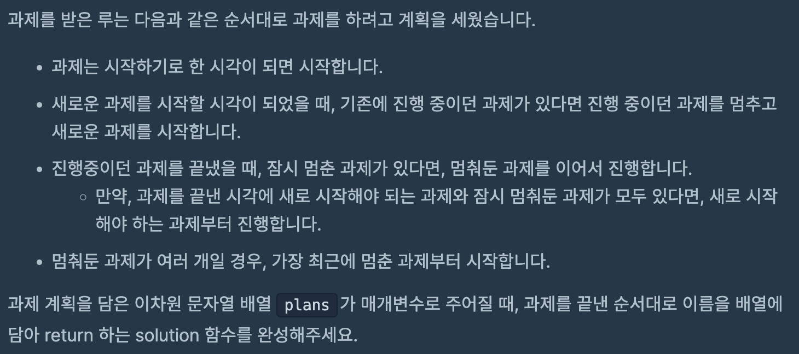
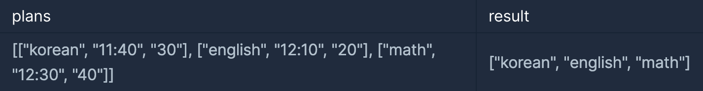
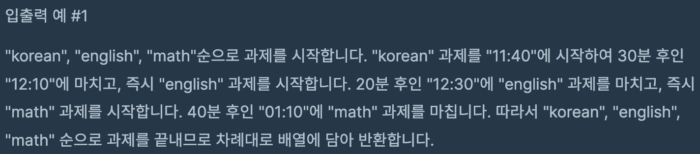

# 과제 진행하기

## programmers

## 문제






이 문제는 짜여진 스케줄에 따라 과제를 진행하는데,

도중에 새로운 과제의 시작 시간이 되면 진행중이던 과제를 멈추고 새로운 과제를 우선시해서 진행한다.

스케줄에 맞는 과제가 없을경우, 중단한 과제를 진행하는데 가장 최근에 멈춘 과제부터 시작한다.

과제를 마친 순서대로 과제의 이름을 배열에 담아 반환하면 된다.

### 풀이

----


스케줄에 따라 과제를 진행 하는 것이기 때문에 과제의 시작시간을 정렬하는게 중요하다고 생각했다.

오름차순으로 과제를 정렬하면 차례로 시작하면 되기 때문에 정렬을 우선시해서 풀었다.


```

  public int ToSec(String time) {

    String[] t = time.split(":");
    int h = Integer.parseInt(t[0]) * 60;
    int m = Integer.parseInt(t[1]);

    return h + m;
  }


   Arrays.sort(plans, (a, b) -> ToSec(a[1]) - (ToSec(b[1])));

  ```

  과제들의 시간은 `12 : 30` 형태로 저장 되어 있으므로 모두 분단위의 형태로 변환해서 정렬했다.

  `String`형으로 저장 되어 있는 `time`을 인자로 받아서 `:`을 기준으로 `split`하고

분단위로 변환해서 `return` 했다. 변환된 시간을 `Arrays.sort`로 정렬을 시켰다.

----

중단한 과제들은 다음 과제를 진행하기 전에 시간이 남으면 진행하는데,

진행 순서는 '가장 최근에 중단한 과제를 먼저 진행한다' 였으니 `Stack`을 이용해서 풀었다.

`Stack`의 특징이 데이터의 삽입과 삭제가 한 곳에서만 이루어 지기 때문에 `LIFO` 특징을 갖고있다.


`Stack<String[]> stop = new Stack<>();`


정렬된 과제들을 가지고 하나씩 진행하는데 

진행중인 과제의 완료 시간이 다음 과제의 시작 시간보다 늦으면

진행중인 과제를 `stop`에 저장하고 다음 과제를 진행 했다.

저장 할 때는 과제를 완료하는데 걸리는 시간을 변경해서 저장하였다.

다음 과제를 진행 하기전에는 진행전 남은 시간동안 `stop`에 가장 최근에 저장된 과제를 진행하도록

`remain` 과 `re_playtime`을 비교해서 다음 과제 시작 전까지 완료 가능 여부를 조사하고 

가능하면 `answer`에 넣어서 완료처리 

불가능하면 다시 완료까지 남은 시간을 `stop`에 다시 저장하는 식으로 문제를 풀었다.

```

    while (size != idx) { // size = plans.length  idx = 진행중인 과제의 인덱스

      name = plans[idx][0];
      time = ToSec(plans[idx][1]);
      period = Integer.parseInt(plans[idx][2]);

      current = time + period;// 과제 완료 시간

      if (size - 1 != idx) { // 마지막 과제인지 체크
        next = ToSec(plans[idx + 1][1]);
        if (current > next) {// 진행중인 과제 종료시간이 나중이면

          stop.push(new String[] { name, current - next + "" });
          // 진행 중이던 과제 중단후 이름과 남은 진행시간 push
          current = next;
          idx++;

          continue;

        }
    }

    answer[z++] = name; // 완료 과제

      while (!stop.isEmpty()) {

        int remain = next - current;// 다음 과제 시작시간까지 남은 시간

        String[] work = stop.pop();

        int re_playtime = Integer.parseInt(work[1]);

        if (remain >= re_playtime) {// 남은 시간동안 중단한 과제 완료 가능

          answer[z++] = work[0];
          current += re_playtime;
        } else {

          stop.push(new String[] { work[0], re_playtime - remain + "" });
          break;
        }

      }

      idx++;
    }
      
      
  ```

  
  ### 코드

  ----


```
import java.util.*;

class Solution {
  public String[] solution(String[][] plans) {
    String[] answer = new String[plans.length];

    Stack<String[]> stop = new Stack<>();

    Arrays.sort(plans, (a, b) -> ToSec(a[1]) - (ToSec(b[1])));

    int size = plans.length;

    int z = 0;
    int idx = 0;
    int current = 0;
    String name = "";
    int time = 0;
    int period = 0;
    int next = 0;
    while (size != idx) {

      name = plans[idx][0];
      time = ToSec(plans[idx][1]);
      period = Integer.parseInt(plans[idx][2]);

      current = time + period;// 끝나는 시간

      if (size - 1 != idx) { // 마지막 과제인지 체크
        next = ToSec(plans[idx + 1][1]);
        if (current > next) {// 진행중인 과제 종료시간이 나중이면

          stop.push(new String[] { name, current - next + "" });// 진행 중이던 과제 중단후 이름과 남은 진행시간 push
          current = next;
          idx++;

          continue;

        }
      }

      answer[z++] = name; // 완료 과제

      while (!stop.isEmpty()) {

        int remain = next - current;// 다음 과제 시작시간까지 남은 시간

        String[] work = stop.pop();

        int re_playtime = Integer.parseInt(work[1]);

        if (remain >= re_playtime) {// 남은 시간동안 중단한 과제 완료 가능

          answer[z++] = work[0];
          current += re_playtime;
        } else {

          stop.push(new String[] { work[0], re_playtime - remain + "" });
          break;
        }

      }

      idx++;
    }

    while (!stop.isEmpty()) {
      answer[z++] = stop.pop()[0];
    }

    return answer;
  }

  public int ToSec(String time) {

    String[] t = time.split(":");
    int h = Integer.parseInt(t[0]) * 60;
    int m = Integer.parseInt(t[1]);

    return h + m;
  }
}
```