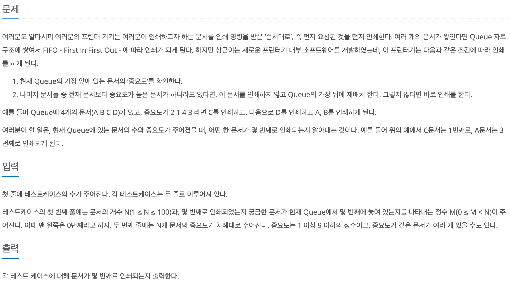

# 프린터 큐

## baekjoon 1966

## 문제

---



이 문제는 프린터에서 일반적으로 실행되는 큐와는 달리 

문서마다 중요도를 갖고 있어서 큐에서 먼저 실행되야하는 데이터여도 

중요도에 따라서 실행 순서가 바뀐다. 

문서 A, B, C, D의 순서대로 큐에 저장되어 있고 중요도가 2, 1, 4, 3 이라면 

프린터는 C D A B 순으로 중요도에 따라 출력한다.

프린터 큐에 아래와 같이 저장 되어 있는 상태에서 
출구|A|B|C|D|입구
|:-:|:-:|:-:|:-:|:-:|:-:|

A를 출력 하기 위해서는 큐에 A의 중요도인 2보다 높은 문서가 없을때만 가능하다.

만약 A보다 높은 중요도를 갖는 문서가 있으면 A를 큐에 마지막에 위치시키고 다음 문서를 검사한다.

출구|B|C|D|A|입구
|:-:|:-:|:-:|:-:|:-:|:-:|

이런식으로 진행하면 다음과 같은 순서로 진행된다.

출구|C|D|A|B|입구
|:-:|:-:|:-:|:-:|:-:|:-:|

출구|D|A|B|입구
|:-:|:-:|:-:|:-:|:-:|

출구|A|B|입구
|:-:|:-:|:-:|:-:|

출구|B|입구
|:-:|:-:|:-:|

출구|입구
|:-:|:-:|

따라서 문서의 출력 순서는 C D A B의 순서로 출력된다.

문제는 특정 문서의 출력 순번을 `return` 하면 된다.

### 풀이
---


문제를 풀기 위해서 나는 두개 큐를 선언해서 사용했다.

하나는 `int[]`로 저장된 문서의 위치와 중요도를 다루는 큐

다른 하나는 중요도만 다루는 큐를 사용했다.

큐의 데이터들을 입력 받으면 `while`문을 통해서 큐에 저장된 문서들을 중요도 순서에 따라 출력하도록 했다.

`printCount`를 통해서 문서의 출력 순번을 추적하였고, 큐에 순서대로 하나씩 `poll`을 해서

중요도가 저장된 큐에서 가장 큰값과 비교하여 일치하면 두개의 큐에서 모두 제거하고 

일치하지 않으면 큐에 다시 삽입하여 맨뒤에 위치 시켰다. 원하는 중요도를 갖는 문서를 찾으면

`while`문은 중단 시키고 `printCount` `return` 했다.


```
import java.util.*;

public class 1966 {
    public static void main(String[] args) {
        Scanner sc = new Scanner(System.in);
        int t = sc.nextInt();  // 테스트 케이스 수

        for (int i = 0; i < t; i++) {
            int n = sc.nextInt();  // 문서의 수
            int m = sc.nextInt();  // 알고 싶은 문서의 현재 위치
            Queue<int[]> documents = new LinkedList<>();  // [문서의 위치, 중요도]
            Queue<Integer> importance = new LinkedList<>();

            for (int j = 0; j < n; j++) {
                int imp = sc.nextInt();
                documents.offer(new int[]{j, imp});
                importance.offer(imp);
            }

            int printCount = 0; //몇 번째로 인쇄
            while (!documents.isEmpty()) {
                int[] current = documents.poll();
                if (current[1] == Collections.max(importance)) {  
                  // 가장 중요도가 높은 문서가 현재 문서라면
                    printCount++;
                    importance.poll();
                    if (current[0] == m) {  // 알고 싶은 문서가 출력되었다면
                        System.out.println(printCount);
                        break;
                    }
                } else {
                    documents.offer(current);
                    importance.offer(importance.poll());
                }
            }
        }
    }
}
```