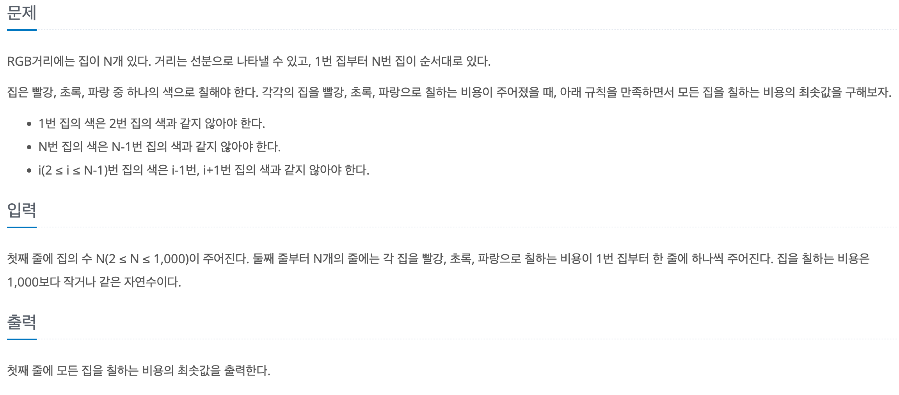
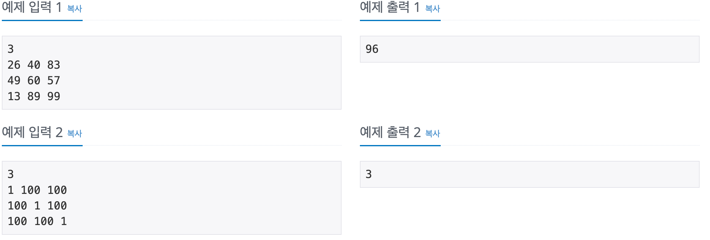

# RGB 거리

## baekjoon 1149

## 문제

---




|#1|<font color="red">R|<font color="green">G|<font color="blue">B
|:-:|:-:|:-:|:-:|
|0|26|40|83
|1|49|60|57
|2|13|89|99

이 문제는 다음과 같이 번지마다 색깔의 비용이 정해져 있다.

이 비용을 최소로 하면서,

연속된 2개의 집은 같은색이 되면 안된다.

예를 들어 #1은 다음과 같이 칠하면 최소가 된다.


번지|RGB|누적 비용
|:-:|:-:|:-:|
0|<font color="red">R|26
1|<font color="green">B|83|
2|<font color="red">R|96

0번지 에서는 최소 비용인 <font color="red"> R</font>이 칠해지고 

1번지는 0번지와 다른 색인 <font color="green"> G</font> <font color="blue"> B</font> 중에서 최소인 <font color="blue"> B</font>

2번지에서는 1번지와 다른 <font color="red"> R </font> <font color="blue"> B</font> 중에서 최소인 <font color="red"> R</font> 을 칠해서 이 마을을 칠하는데 최소 비용은 96이 된다.


### 풀이
___
단순히 색이 연속되지 않고 번지마다 최소의 값으로 칠하면 최솟값이 나온다고 생각 할 수 있지만,

비용이 누적되는 형태이기 때문에 모든 조합을 생각해서 풀어야 한다.

따라서 DP 방법을 이용해서 풀었다. 
모든 조합을 구해야 하기 때문에 모든 조합의 비용을 다 구해서 마지막에 누적 비용이 최소인 값을 구한다.


번지|R|G|B
|:-:|:-:|:-:|:-:|
0|26|40|83
1|49|60|57
2|13|89|99

위와 같이 비용이 저장 되어 있으면

누적비용은 다음과 같다.

번지|R|G|B
|:-:|:-:|:-:|:-:|
0|26|40|83
1|49 + 40|60 + 26|57 +26
2|13 + 57 + 26|89 + 57 + 26|99 + 60 + 26

마지막 번지에서 누적 비용의 최솟값이 문제이 답이 된다.

따라서 점화식을 구해 보면 다음과 같다.


    dp[i][0] = Math.min(dp[i-1][1], dp[i-1][2])+r; 
    dp[i][1] = Math.min(dp[i-1][0], dp[i-1][2])+g;
    dp[i][2] = Math.min(dp[i-1][0], dp[i-1][1])+b;
     // 해당 번지에 색을 칠해서 생기는 누적 비용은 
     // 그 전 번지에 칠해진 누적 비용값 중 최솟값을 해당 색깔의 비용과 더한다.


```
import java.util.*;

public class 1149{
    public static void main(String[] args){
        Scanner sc = new Scanner(System.in);
        int N = sc.nextInt();
        
        int[][] dp = new int[N+1][3];
        
        for(int i = 1; i <= N; i++){
            int r = sc.nextInt();
            int g = sc.nextInt();
            int b = sc.nextInt();
            
            dp[i][0] = Math.min(dp[i-1][1], dp[i-1][2])+r;
            dp[i][1] = Math.min(dp[i-1][0], dp[i-1][2])+g;
            dp[i][2] = Math.min(dp[i-1][0], dp[i-1][1])+b;
            
        }
        System.out.println(Math.min(dp[N][0], Math.min(dp[N][1], dp[N][2] )));
    }
}
```