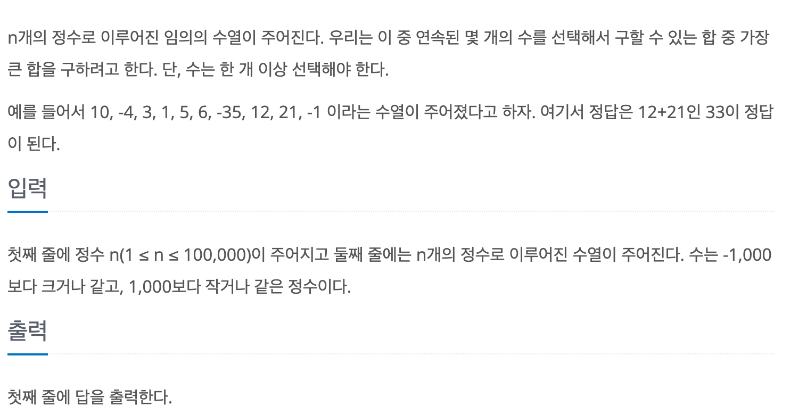

# 연속 합

## baekjoon 1912

## 문제

---


이 문제는 정수의 수열이 주어지고 수열 내에서 연속된 몇 개의 수를 선택해 구할 수 있는 합 중에서 가장 큰 값을 구하는 문제이다.

10|-4|3|1|5|6|-35|12|21|-1
|:-:|:-:|:-:|:-:|:-:|:-:|:-:|:-:|:-:|:-:|

다음과 같이 주어지면 

10|-4|3|1|5|6|-35|<font color="red"> 12|<font color="red">21|-1
|:-:|:-:|:-:|:-:|:-:|:-:|:-:|:-:|:-:|:-:|

빨간색 글씨의 수만 선택해서 합을 구하는것이 수열 내에서 연속된 수를 선택해서 구하는 합중에 가장 큰 값이다.


### 풀이
----

연속된 수의 합을 구하는 문제이기 때문에 DP의 메모이제이션을 이용하면 편할거 같다고 생각했다.


10|-4|3|1|5|6|-35|12|21|-1
|:-:|:-:|:-:|:-:|:-:|:-:|:-:|:-:|:-:|:-:|

이렇게 구성된 수열을 이용해서 연속된 수를 더하면 된다. 

단, 각 항의 수를 더하는데 있어서 그전에 합들과 비교하여 더 큰값을 선택하면 된다.

각 항을 이전의 항들과 더한 값을 더하는데 그 더한 값이 각 항의 수보다 작다면

이전의 항들을 더한 값에 더하는것이 아닌, 자신을 처음 으로 더하는 수부터 다시 시작한다.

예를 들면 10부터 시작해서 연속된 항의 수를 더하면 아래와 같다.

10|-4|3|1|5|6|-35|12|21|-1
|:-:|:-:|:-:|:-:|:-:|:-:|:-:|:-:|:-:|:-:|
|10|6|9|10|15|21|-14|12|33|32

1항만 더했을때 최대값은 10

1항 2항을 더하면 최대값은 6이다. 

그 이유는 연속된 수의 합이기 때문에 2항인 -6부터 시작해서 더하는 것보다

1항부터 시작해서 2항까지 더하는 값이 더 크기 때문이다.

따라서 점화식은 다음과 같다.

`dp[i] = Math.max(dp[i - 1] + temp, temp);`

dp배열의 각 항은 1부터 i번째 까지 수의 연속된 수들의 합중에서 가장 큰값이다. 

```
import java.util.*;

public class Main {
  public static void main(String[] args) {
    Scanner sc = new Scanner(System.in);

    int n = sc.nextInt();

    int[] dp = new int[n];
    int max = -1001;

    dp[0] = sc.nextInt();
    for (int i = 1; i < n; i++) {
      int temp = sc.nextInt();
      dp[i] = Math.max(dp[i - 1] + temp, temp);
    }
    Arrays.sort(dp);
    System.out.println(dp[n - 1]);
  }
}
```

