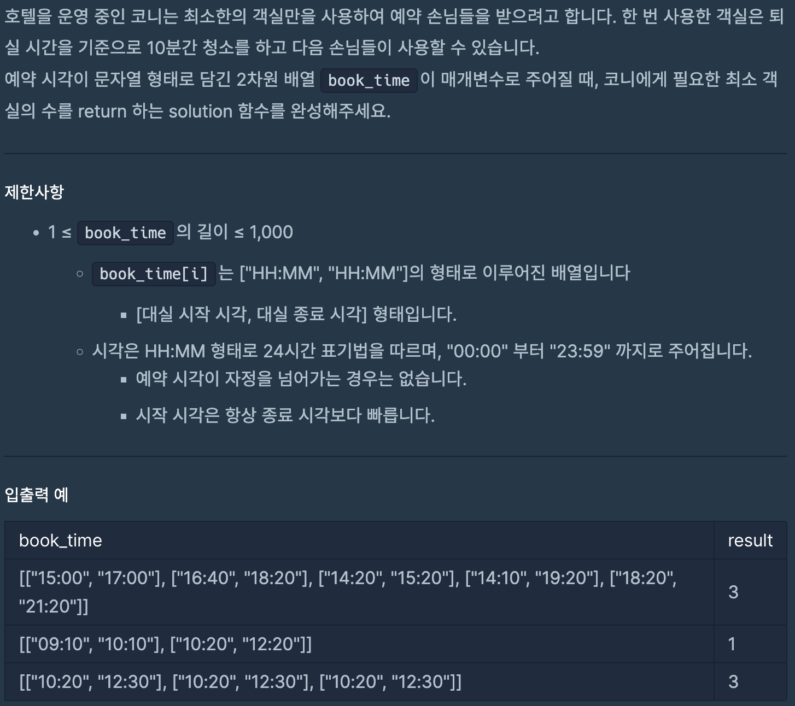
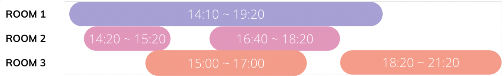

# 호텔 대실

## programmers

## 문제





이 문제는 예약시간이 담긴 `book_time`을 통해서 필요한 최소 객실의 수를 구하는 문제이다.

예약 시간이 최대로 겹치게 될 때 필요한 방의 개수가 문제의 답이된다.

### 풀이
----

시간 순서대로 손님을 받기 위해서 시작시간을 기준으로 정렬했다.

```
Arrays.sort(book_time, (a, b) -> timeToMinutes(a[0]) - timeToMinutes(b[0]));
```

그다음 문자열 형태로 주어진 예약시간을 분단위 형태로 변환하고 

종료시간 10분 뒤부터 방을 이용가능 하기때문에  다음과 같이 했다.


```
private static int timeToMinutes(String time) {
    String[] temp = time.split(":");
    int h = Integer.parseInt(temp[0]);
    int m = Integer.parseInt(temp[1]);
    return h * 60 + m;
  }

  for (String[] time : book_time) {
      int start = timeToMinutes(time[0]);
      int end = timeToMinutes(time[1]) + 10;
```

`rooms`에 시작시간이 가장빠른 예약의 종료시간을 추가 하면서,

 현재 예약의 종료시간이 되면 다음 예약으로 교체하는 방식으로 풀었다.

종료시간이 빠른 데이터 부터 교체 해야 하므로 `PriorityQueue`를 사용했다.

예를 들어 `book_time`에 저장된 예약 시간이 다음과 같다면


rooms에는 다음과 같은 순서로 데이터들이 작업을 진행한다.


19:30|
|:-:|

15:30|19:30|
|:-:|:-:|


15:30|17:10|19:30|
|:-:|:-:|:-:|


17:10|18:30|19:30|
|:-:|:-:|:-:|

18:30|19:30|21:30|
|:-:|:-:|:-:|


이처럼 종료시간이 가장 빠른 예약을 다음 예약으로 교체 해주면,

`rooms`에 남아있는 데이터의 개수가 필요한 방의 개수이므로 `rooms.size`를 `return `한다.


### 코드
----

```
import java.util.*;

class Solution {
  public int solution(String[][] book_time) {
    Arrays.sort(book_time, (a, b) -> timeToMinutes(a[0]) - timeToMinutes(b[0]));
    // 시작 시간을 기준으로 오름차순 정렬

    PriorityQueue<Integer> rooms = new PriorityQueue<>();
    // 종료 시간이 빨리 끝나는 방을 먼저 제거하기 위해서

    for (String[] time : book_time) {
      int start = timeToMinutes(time[0]);
      int end = timeToMinutes(time[1]) + 10;

      if (!rooms.isEmpty() && rooms.peek() <= start) { //  다음 예약진행 
        rooms.poll();
      }

      rooms.add(end);
    }
    return rooms.size();
  }

  private static int timeToMinutes(String time) {
    String[] temp = time.split(":");
    int h = Integer.parseInt(temp[0]);
    int m = Integer.parseInt(temp[1]);
    return h * 60 + m;
  }
}
```