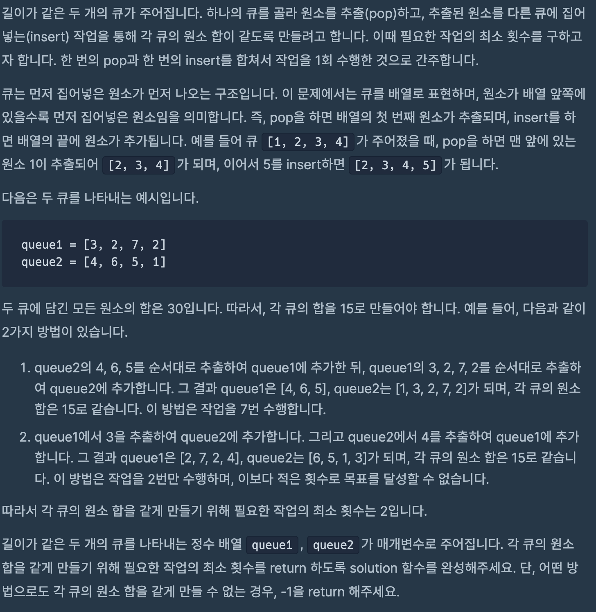
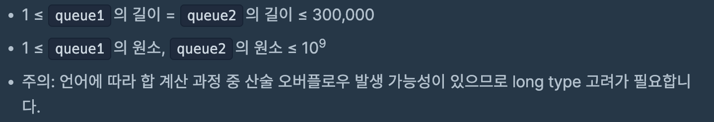

# 두 큐 합 같게 만들기

## programmers

## 문제




이 문제는 길이가 같은 두 개의 큐가 주어지고 큐의 특성을 이용해서 

두 큐의 합이 같도록 만드는 최소 횟수를 구하는 문제이다.

하나의 데이터를 추출하고 삽입하는 작업을 1회 횟수로 간주한다.

### 풀이 

----

두 큐가 다음과 같이 주어진다면, 두 큐의 총합은 30으로 하나의 큐의 모든 원소의 합을 15로 만들어야 한다.

따라서 A큐의 합이 14이고 B큐의 합이 16이므로 B에서 하나의 원소를 추출한다.

A|3|2|7|2|
|:-:|:-:|:-:|:-:|:-:|

B|4|6|5|1|
|:-:|:-:|:-:|:-:|:-:|

다음은 A큐의 합이 18이고 B큐의 합이 12이므로 A에서 하나의 원소를 추출한다.

A|3|2|7|2|4|
|:-:|:-:|:-:|:-:|:-:|:-:|

B|6|5|1|
|:-:|:-:|:-:|:-:|

A큐의 합이 15이므로 자동으로 B큐의 합도 15가 되서 문제의 답은 2가된다.

A|2|7|2|4|
|:-:|:-:|:-:|:-:|:-:|

B|6|5|1|3
|:-:|:-:|:-:|:-:|:-:|


다음과 같이 진행하기 위해서 주어진 큐에 있는 원소의 합을 구해서 `target`을 지정해야 한다.

따라서 `int[]`로 주어진 데이터를 `Queue`에 담고 원소들의 합을 구한다.


```

int n = queue1.length;
Queue<Integer> q1 = new LinkedList<>();
Queue<Integer> q2 = new LinkedList<>();

for (int i = 0; i < n; i++) {
      q1.offer(queue1[i]);
      q2.offer(queue2[i]);
      sum1 += queue1[i];
      sum2 += queue2[i];
    }

long target = (sum1 + sum2) / 2;
```

이 상태에서 `target`과 하나의 큐의 합을 비교해서 어떤 큐에서 데이터를 추출할지 결정한다.

```
int diff = (int) (sum1 - target);
      if (diff == 0)
        return answer;

      if (diff < 0) { //q2의 합이 더 클경우
        int temp = q2.poll();
        sum2 -= temp;
        sum1 += temp;
        q1.offer(temp);
      } else {     // q1의 합이 더 클 경우
        int temp = q1.poll();
        sum1 -= temp;
        sum2 += temp;
        q2.offer(temp);
      }
```

`while`문을 돌면서 두 큐의 합이 같아질때까지 반복하는데, 두 큐의 합을 같게 만들지 못하는 경우에는 

`while`문을 종료하는 조건을 설정해야한다. 

이 부분이 가장 어려웠는데, 최악의 조건을 생각해서 조건을 설정했다.

A|3|2|7|2|
|:-:|:-:|:-:|:-:|:-:|

B|4|6|5|1|
|:-:|:-:|:-:|:-:|:-:|

A큐에 있는 데이터를 B큐에 모두 보낸뒤에 

A|
|:-:|

B|4|6|5|1|3|2|7|2|
|:-:|:-:|:-:|:-:|:-:|:-:|:-:|:-:|:-:|

다시 B큐에 있는 데이터를  A큐에 모두 보내는 방법이 최악의 조건 이라 생각했다.

A|4|6|5|1|3|2|7|2
|:-:|:-:|:-:|:-:|:-:|:-:|:-:|:-:|:-:|

B|
|:-:|

이렇게 하면 횟수가 12번이 된다. 처음에는 4번 이동하고 다음은 8번 이동한다.

n으로 길이가 같은 두 큐의 최악의 이동 조건은 처음 n번 이동하고 다음은 n*2 번 이동하는 것이다.

```
while (answer < n * 3) {
      int diff = (int) (sum1 - target);
      if (diff == 0)
        return answer;

      if (diff < 0) { //q2의 합이 더 클경우
        int temp = q2.poll();
        sum2 -= temp;
        sum1 += temp;
        q1.offer(temp);
      } else {     // q1의 합이 더 클 경우
        int temp = q1.poll();
        sum1 -= temp;
        sum2 += temp;
        q2.offer(temp);
      }
      answer++;
    }
```

### 코드 
----
```
import java.util.Queue;
import java.util.LinkedList;

class Solution {
  public int solution(int[] queue1, int[] queue2) {
    int n = queue1.length;
    long sum1 = 0, sum2 = 0;

    Queue<Integer> q1 = new LinkedList<>();
    Queue<Integer> q2 = new LinkedList<>();

    for (int i = 0; i < n; i++) {
      q1.offer(queue1[i]);
      q2.offer(queue2[i]);
      sum1 += queue1[i];
      sum2 += queue2[i];
    } // 큐 초기화 및 원소들의 합 구하기

    if ((sum1 + sum2) % 2 != 0)
      return -1; // 원소들의 합이 홀수이면 두 큐의 합을 같게 만들지 x

    long target = (sum1 + sum2) / 2;
    int answer = 0;

    while (answer < n * 3) {
      int diff = (int) (sum1 - target);
      if (diff == 0)
        return answer;

      if (diff < 0) {
        int temp = q2.poll();
        sum2 -= temp;
        sum1 += temp;
        q1.offer(temp);
      } else {
        int temp = q1.poll();
        sum1 -= temp;
        sum2 += temp;
        q2.offer(temp);
      }
      answer++;
    }

    return -1;
  }
}

```