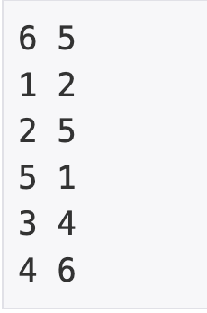

# 연결 요소의 개수

## baekjoon 11724

## 문제


이 문제는 그래프에서 노드끼리 연결된 그룹의 개수를 구하는 문제이다.

### 풀이
---




입력의 첫 줄에는 노드의 개수와 간선의 개수가 주어지고,

나머지는 연결된 노드의 번호들이 주어진다.

`ArrayList`를 이용해서 노드마다 연결 되어있는 노드의 번호를 추가하고,

각 노드들을 방문하면 `visited`를 `true`처리하여 하나의 그룹을 모두 방문한다.


```
static boolean[] visited;
static ArrayList<Integer>[] list;


list = new ArrayList[N + 1];
visited = new boolean[N + 1];
```

1|2|5
|:-:|:-:|:-:|

2|1|5
|:-:|:-:|:-:|

3|4
|:-:|:-:|

4|3|6
|:-:|:-:|:-:|

5|1|2
|:-:|:-:|:-:|

6|4
|:-:|:-:|


```
for (int j = 0; j < M; j++) {
      int x = sc.nextInt();
      int y = sc.nextInt();

      list[x].add(y);
      list[y].add(x);
    }
```

```
public static void bfs(int start) {
    Queue<Integer> que = new LinkedList<>();
    visited[start] = true;
    que.add(start);

    while (!que.isEmpty()) {
      int temp = que.poll();
      for (int i : list[temp]) {
        if (!visited[i]) {
          visited[i] = true;
          que.add(i);
        }
      }
    }
  }
```

```
    int count = 0;
    for (int k = 1; k <= N; k++) {
      if (!visited[k]) {
        bfs(k);
        count++;
      }
    }
```


각 그룹을 방문하면 count에 ++처리 해주었다.

bfs를 사용해서 한 노드를 시작으로 노드가 속한 그룹을 모두 방문하는 식으로 문제를 풀었다.


### 코드
----

```
import java.util.*;

public class Main {
  static boolean[] visited;
  static ArrayList<Integer>[] list;

  public static void main(String[] args) {
    Scanner sc = new Scanner(System.in);
    int N = sc.nextInt(); // 정점의 개수
    int M = sc.nextInt(); // 간선의 개수

    list = new ArrayList[N + 1];
    visited = new boolean[N + 1];
    for (int i = 1; i <= N; i++) {
      list[i] = new ArrayList<Integer>();
    }

    for (int j = 0; j < M; j++) {
      int x = sc.nextInt();
      int y = sc.nextInt();

      list[x].add(y);
      list[y].add(x);
    }
    int count = 0;
    for (int k = 1; k <= N; k++) {
      if (!visited[k]) {
        bfs(k);
        count++;
      }
    }
    System.out.println(count);
  }

  public static void bfs(int start) {
    Queue<Integer> que = new LinkedList<>();
    visited[start] = true;
    que.add(start);

    while (!que.isEmpty()) {
      int temp = que.poll();
      for (int i : list[temp]) {
        if (!visited[i]) {
          visited[i] = true;
          que.add(i);
        }
      }
    }
  }
}

```