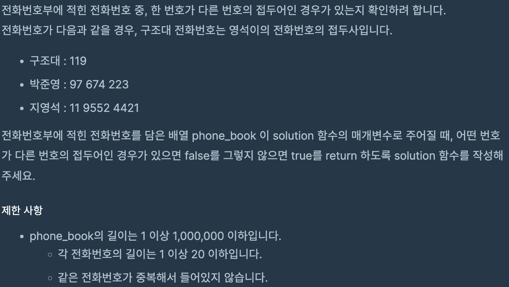
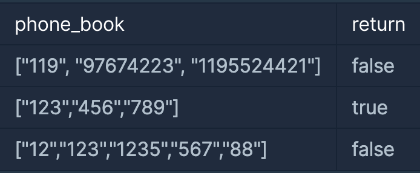

# 전화번호 목록

## programmers

## 문제





이 문제는 한 번호가 다른 번호의 접두어인 경우가 있는지 확인하는 문제이다.

## 풀이
---

문자열 배열을 정렬하면 길이가 짧고 사전순으로 정렬 되기 때문에,

문제에서 주어지 `phone_book[]`을 정렬해서

다음 인덱스와 비교해서 접두어가 있는지 확인했다.

비교할때는 `startWith`를 사용하였다.


```
import java.util.*;

class Solution {
  public boolean solution(String[] phone_book) {

    Arrays.sort(phone_book);

    for (int i = 0; i < phone_book.length - 1; i++) {
      if (phone_book[i + 1].startsWith(phone_book[i]))
        return false;

    }
    return true;

  }
}
```
