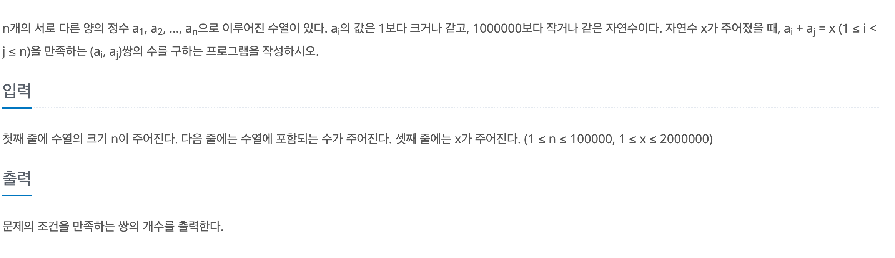

# 두 수의 합

## baekjoon 3273

## 문제



이 문제는 n개의 서로 다른 양의 정수로 이루어진 수열이 주어지고,

X가 주어지면 수열의 두 수의 합이 X가 되는 순서 쌍을 구하는 문제이다.

### 풀이
---
수열을 배열에 저장하고 오름차순으로 정렬해서 두 수의 합이 X가 되지 않는다면,

정렬한 배열에서 인덱스를 하나씩 옮기면서 X를 찾아가는 방식으로 풀었다.

배열을 정렬하면 다음과 같다.

1|2|3|5|7|9|10|11|12
|:-:|:-:|:-:|:-:|:-:|:-:|:-:|:-:|:-:|

X가 13으로 주어졌고, 13을 만드는 두 수를 찾기 위해 배열의 양 끝 인덱스에서 시작해서
인덱스의 위치를 점차 중앙으로 옮기면서 13을 만드는 두 수를 찾는다.

양 끝 인덱스를 `left` `right`라 하고 배열에 인덱스 번호는 다음과 같다.

```
int left = 0; 
int right = n - 1;
```


1(left)|2|3|5|7|9|10| 11|12(right)
|:-:|:-:|:-:|:-:|:-:|:-:|:-:|:-:|:-:|

이 경우에는 13이 되고, 수열은 서로 다른 양의 정수로 이루어져 있기 때문에 

1과 12는 다른 수와 더해서 13을 만들지 못하기 때문에 인덱스를 바꿔주고 `count++`한다.
```
if (num[left] + num[right] == x) {
        count++;
        left++;
        right--;
      }
```


1|2(left)|3|5|7|9|10|11(right)|12
|:-:|:-:|:-:|:-:|:-:|:-:|:-:|:-:|:-:|


1|2|3(left)|5|7|9|10(right)|11|12
|:-:|:-:|:-:|:-:|:-:|:-:|:-:|:-:|:-:|

이 두 경우에도 13이 되기 때문에 `count++`하고 인덱스를 옮긴다.

1|2|3|5(left)|7|9(right)|10|11|12
|:-:|:-:|:-:|:-:|:-:|:-:|:-:|:-:|:-:|

이 경우에는 두 수의 합이 14이기 때문에 X보다 크다.

따라서 `right` 인덱스를 왼쪽으로 옮겨서 두 수의 합을 작게 만들어준다.
```
else if (num[left] + num[right] > x) {
        right--;
      }
```

1|2|3|5(left)|7(right)|9|10|11|12
|:-:|:-:|:-:|:-:|:-:|:-:|:-:|:-:|:-:|

이 경우에는 두 수의 합이 12가 되고 X보다 작기 때문에, `left` 인덱스를 오른쪽으로 옮겨야 한다. 

하지만, 그렇게 되면 수열에 서로 다른 두 수의 합이 아니기 때문에 여기서 멈춰야 한다.

이러한 작업들을 `while`문을 통해서 반복하고 `left`가 `right`보다 작을 경우에만 진행한다.


### 코드 
---


```
import java.util.*;

public class Main {
  public static void main(String[] args) {
    Scanner sc = new Scanner(System.in);
    int n = sc.nextInt();

    int[] num = new int[n];
    for (int i = 0; i < n; i++) {
      num[i] = sc.nextInt();
    }

    int x = sc.nextInt();
    Arrays.sort(num);
    int count = 0;
    int left = 0;
    int right = n - 1;
    while (left < right) {
      if (num[left] + num[right] == x) {
        count++;
        left++;
        right--;
      } else if (num[left] + num[right] > x) {
        right--;
      } else {
        left++;
      }
    }
    System.out.println(count);
  }
}
```