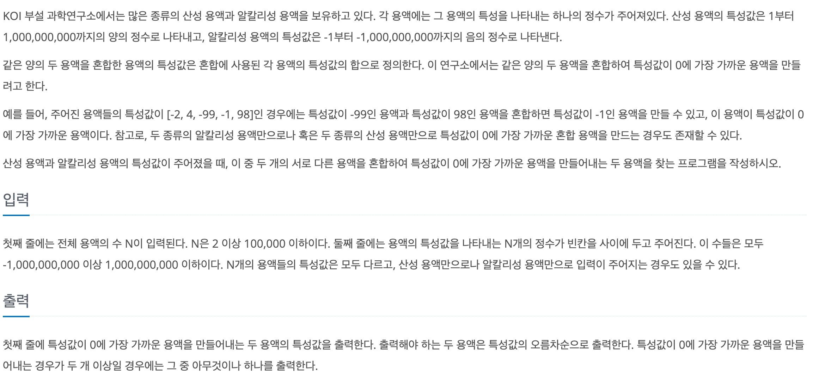

# 두 용액

## baekjoon 2470

## 문제



이 문제는 산성용액과 알칼리성 용액을 혼합해서 특성값을 0에 가장 가깝게 만드는 용액을 찾는 문제이다.

특성값은 산성용액은 양의 정수로, 알칼리성 용액은 음의 정수로 주어지며 두 용액의 특성값을 더하면

혼합한 용액의 특성값이 나오게 된다.


### 풀이
---
0에 가까운 특성값을 가진 혼합 용액을 찾기 위해서는 특성값의 절대값이 비슷한 용액 끼리 합치면 된다.

따라서 용액의 특성값들을 오름차순으로 정렬 한뒤에 양쪽 인덱스에서 시작해서 특성값이 0에 가까운 혼합 용액을 찾았다.

```
int left = 0;
int right = n - 1;
```

두 수의 합을 `sum`에 저장해서 0에 가까운 수를 찾기 위해서

`while`문을 통해서 반복하여 `Math.abs(sum)`이 가장 작은 경우의 두 수를 찾아서 result에 저장했다.

이렇게 하나씩 비교하고 다음 경우로 넘어갈때에는 

`sum`이 0 보다 크면 `right--`하고 0보다 작으면 `left++`해서 더 0에 가까운 `sum`을 찾아주는 방식으로 풀었다. 

```
while (left < right) {
      int sum = num[left] + num[right];

      if (min > Math.abs(sum)) {
        min = Math.abs(sum);
        result[0] = num[left];
        result[1] = num[right];
      }

      if (sum < 0) {
        left++;
      } else if (sum > 0) {
        right--;
      } else {
        break;
      }
    }
```

 ### 코드
 ---

```
import java.io.*;
import java.util.*;

public class Main {
  public static void main(String[] args) throws IOException {
    BufferedReader br = new BufferedReader(new InputStreamReader(System.in));
    int n = Integer.parseInt(br.readLine());

    int[] num = new int[n];
    StringTokenizer st = new StringTokenizer(br.readLine());

    for (int i = 0; i < n; i++) {
      num[i] = Integer.parseInt(st.nextToken());
    }

    Arrays.sort(num);

    int left = 0;
    int right = n - 1;
    int min = Integer.MAX_VALUE;
    int[] result = new int[2];

    while (left < right) {
      int sum = num[left] + num[right];

      if (min > Math.abs(sum)) {
        min = Math.abs(sum);
        result[0] = num[left];
        result[1] = num[right];
      }

      if (sum < 0) {
        left++;
      } else if (sum > 0) {
        right--;
      } else {
        break;
      }
    }

    System.out.println(result[0] + " " + result[1]);

  }
}

```