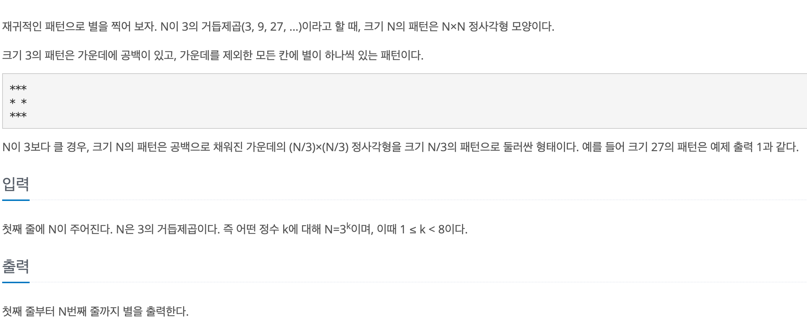
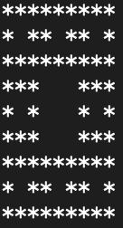
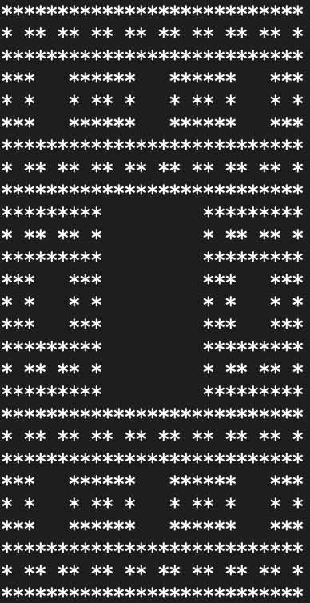

# 별 찍기 - 10

## baekjoon 2447

## 문제



이 문제는 N이 3의 거듭제곱으로 주어 질 때, 일정한 패턴으로 채워진 N x N 크기의 정사각형을 출력하는 문제이다.


가장 작은 패턴은 3 x 3 크기의 정사각형에 가운데 부분에 공백을 두고 나머지는 *로 채운 형태이다.

그 다음 크기의 패턴은 9 x 9 크기의 정사각형에 마찬가지로 가운데 부분에 공백을 두고 나머지는 그 전 패턴으로 채운 형태이다.

따라서 2차원 배열로 생각해보면 3 x 3 크기의 패턴에는 (1,1)에 공백이 있으며,


9 x 9 크기의 패턴에서는 기본적으로 가운데 공백의 인덱스는 다음과 같다.


(3,3) (3,4) (3,5)

(4,3) (4,4) (4,5)

(5,3) (5,4) (5,5)





따라서 해당 크기의 패턴에서 가운데 부분만 특정 하면 그 전 패턴이 모인 3 x 3 크기의 배열에서 (1,1)만 공백이다.





```
static void isCenter(int i, int j, int n){ 
        if((i/n) % 3 == 1 && (j/n) % 3 ==1){
            sb.append(' ');
        } else {
            if(n == 1) sb.append('*');
            else isCenter(i, j, n/3);
        }
    }
```


따라서 해당 크기의 패턴을 3 x 3의 형태로 보고 (1,1)에 해당하는 인덱스인지 판별하고,

아니면 그 전의 크기의 패턴을 다시 3 x 3의 형태로 봐서 (1,1)에 해당하는 인덱스인지 재귀 함수를 통해서 판별한다.

결국 n이 1이 되면 그 부분은 별로 찍는다.


```
import java.util.*;

public class 2447{
    static StringBuilder sb = new StringBuilder();
    public static void main(String[] args){
        Scanner sc = new Scanner(System.in);
        
        int n = sc.nextInt();
        
        for(int i = 0; i < n; i++){
            for(int j = 0; j< n; j++){
                isCenter(i,j,n);
            }
            sb.append('\n');
        }
        System.out.println(sb);
    }
    static void isCenter(int i, int j, int n){
        if((i/n) % 3 == 1 && (j/n) % 3 ==1){
            sb.append(' ');
        } else {
            if(n == 1) sb.append('*');
            else isCenter(i, j, n/3);
        }
    }
}

```