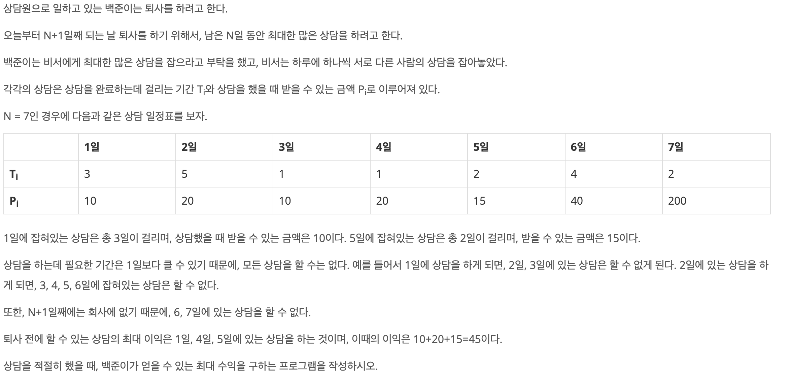
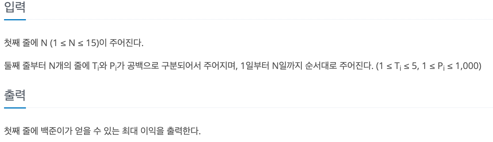

# 퇴사

## baekjoon 14501

## 문제




이 문제는 퇴사하기전 최대한의 효율로 상담을 해서 이익을 최대화 하는 문제이다.

스케줄표가 상담일수와 보상금액으로 이루어져있어서 퇴사하기전 까지 할 수 있는 상담이 정해져있다.

### 풀이

---

상담일수와 보상금액을 `T[]`와 `P[]`에 입력받아 저장하고 `dp[]`에 최대 이익을 저장했다.

퇴사일이 정해져 있기 때문에 `next`에 상담이 끝난 일수를 저장해서 퇴사일을 넘기는 상담을 진행하지 않도록 했다.

dp 방법으로 `dp[j] = Math.max(dp[j+1], P[j] + dp[next])` 을 통해 

퇴사일 부터 역순으로 첫날까지의 이익을 계산해서 저장했다.

매번 dp를 오름차순으로 풀었던거 같은데 역으로 풀수 있어서 역으로 풀었다.


### 코드
----


```
import java.io.*;
import java.util.*;

public class 14501{
    public static void main(String[] args) throws IOException{
        BufferedReader br = new BufferedReader(new InputStreamReader(System.in));
        
        int n = Integer.parseInt(br.readLine());
        int[] T = new int[n+1];
        int[] P = new int[n+1];
        int[] dp = new int[n+2];
        
        for(int i = 1; i <= n; i++){
            StringTokenizer st = new StringTokenizer(br.readLine(), " ");
            T[i] = Integer.parseInt(st.nextToken());
            P[i] = Integer.parseInt(st.nextToken());
        }
        for(int j = n; j >0; j--){
            int next = j + T[j];
            
            if(next > n + 1){
                dp[j] = dp[j+1];
            } else {
                dp[j] = Math.max(dp[j + 1], P[j] + dp[next]);
            }
        }
        System.out.println(dp[1]);
    }
}
```