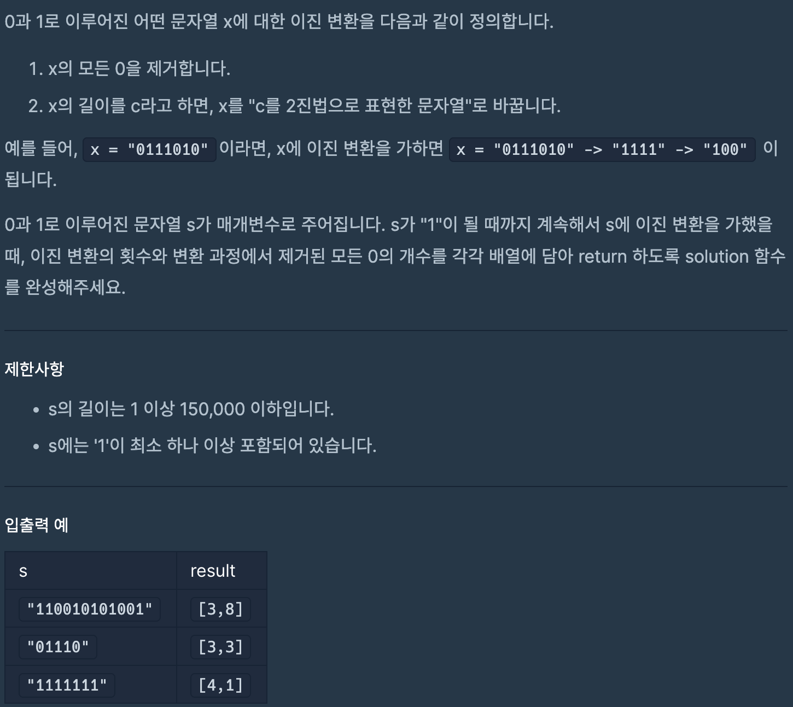

# 이진 변환 반복하기

## programmers

## 문제



이 문제는 2진수로 주어진 문자열 x를 0을 제거하고 나서 나온 문자열의

길이를 다시 2진수의 문자열로 바꾸는 것을 반복해서 

마지막 '1' 되면 그 동안 제거 했던 0의 개수와 변환 횟수를 return 하는 문제이다


### 풀이
---

변환 전에 길이를 length에 저장하고 0을 공백으로 변환 하기위해서 replaceAll을 사용했다.

그러고 나서의 길이를 length에 빼준다면 제거된 0의 개수가 나오고 

toBinaryString을 사용해서 쉽게 2진수의 문자열로 변환했다.

```
class Solution {
  public int[] solution(String s) {
    int zero = 0;
    int count = 0;
    while (!s.equals("1")) {
      int length = s.length();
      s = s.replaceAll("0", "");
      zero += length - s.length();
      s = Integer.toBinaryString(s.length());
      count++;
    }
    return new int[] { count, zero };
  }

}

```
