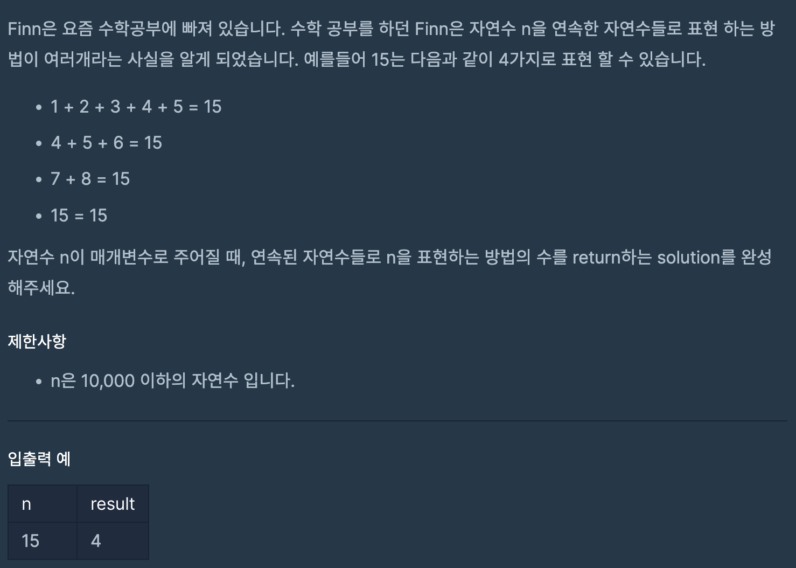

# 숫자의 표현

## programmers

## 문제



이 문제는 숫자 n이 주어지면 연속된 자연수의 합으로 n을 표현하는 방법의 수를 구하는 문제이다.

### 풀이
---

어떤수가 주어지던 그 수를 2로 나눈 수의 연속된 자연수와의 합은 주어진 수보다 같거나 크다.

그래서 2중 for문을 통해서 1부터 시작해서 `n / 2`까지 연속된 수를 합해서 n과 비교해 같으면 count했다.


```
class Solution {
  public int solution(int n) {
    int answer = 1;
    for (int i = 1; i <= n / 2; i++) {
      int sum = i;
      for (int j = i + 1; sum < n; j++) {
        sum += j;
      }
      if (sum == n)
        answer++;
    }
    return answer;
  }
}
```