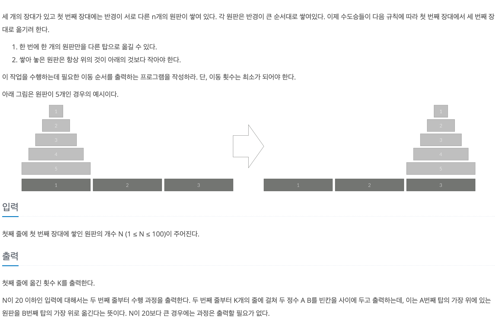

# 하노이 탑

## baekjoon 1914

## 문제




### 풀이
---
5번 원판을 3번 장대에 옮기기 위해서는 1,2,3,4원판을 2번장대에 옮겨놔야 한다.

그러고 나서, 4번 원판을 3번 장대에 옮기기 위해서는 1,2,3 원판을 1번장대에 옮기고,

3번 원판을 3번장대에 옮기기 위해서 1,2 2번장대로 옮기고,

다시 2번을 3번장대에 옮기기 위해서는 1 원판을 1번 장대로 옮기고 마지막 1 원판을 3번 장대에 옮기면 된다.

맨 밑에 원판을 옮기기 위해서는 위에 있는 나머지 원판들을 남은 장대에 옮기는게 먼저이고 이것이 반복된다.

따라서 하노이탑은 재귀로 풀 수 있는 대표적인 문제이다.


주어진 N개의 원판을 `from` 장대에서 `to` 장대로 옮기기 위해서는

위에 있는 N-1개의 원판을 `from` 장대에서 `mid` 장대로 먼저 옮기고,

마지막 원판을 `to` 옮기고 같은 작업을 반복해서 해주면 된다.


```
public static void hanoi(int N, int from, int mid, int to) {
    if (N == 1) {
      System.out.println(from + " " + to);
      return;
    } else {
      hanoi(N - 1, from, to, mid);
      System.out.println(from + " " + to);
      hanoi(N - 1, mid, from, to);
    }
  }
```


```
import java.util.*;
import java.math.*;

public class Main {
  public static void main(String[] args) {
    Scanner sc = new Scanner(System.in);
    int N = sc.nextInt();

    System.out.println((new BigInteger("2")).pow(N).subtract(BigInteger.ONE));
    if (N <= 20) {
      hanoi(N, 1, 2, 3);
    }
  }

  public static void hanoi(int N, int from, int mid, int to) {
    if (N == 1) {
      System.out.println(from + " " + to);
      return;
    } else {
      hanoi(N - 1, from, to, mid);
      System.out.println(from + " " + to);
      hanoi(N - 1, mid, from, to);
    }
  }
}
```