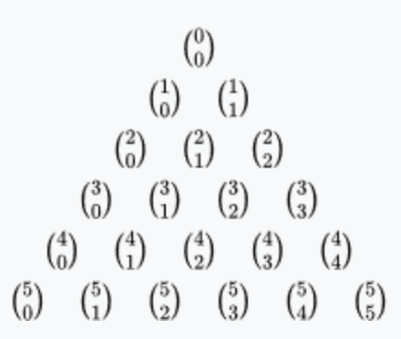
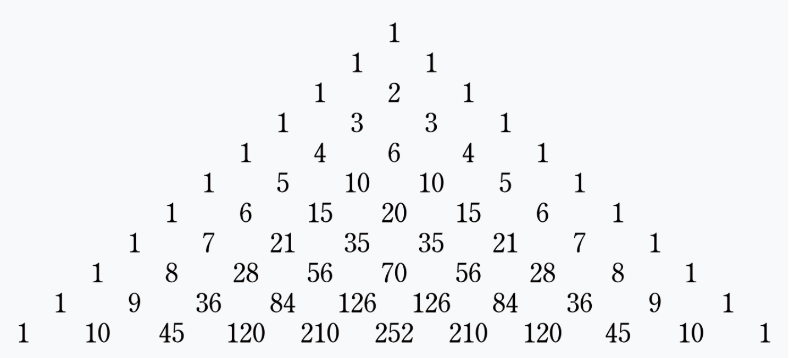

# 이항 계수 2

## baekjoon 11051

## 문제


이항 계수란, 주어진 크기의 집합에서 특정 개수의 원소를 선택하는 경우의 수를 뜻한다.

주로 다항식 전개, 확률론, 통계학에서 활용된다.

C(n,k)


C(n,k) = n! / k!(n-k)!


C(n,k) = C(n-1, k-1) + C(n-1,k)

n개에서 k개를 뽑는 경우의 수는 하나를 고정시켜서 뽑는 경우의 수와 하나를 고정시켜서 뽑지 않는 경우의 수의 합과 같다.

예를 들면, (A,B,C,D,E) 5개 중에 2개를 뽑는 경우의 수는

A를 고정시켜서 뽑은 경우의 수와 A를 제외하고서 나머지에서 2개를 뽑는 경우의 수의 합이다.

C(5,2) = C(4,1) + C(4,2)

여기서 나온 원리가 바로 파스칼의 삼각형이다.






### 풀이
---

처음에는 일반적인 확률에서의 이항 계수를 생각해서 팩토리얼과 재귀를 통해서 풀었지만,

N의 범위가 1000까지 가능해서 int나 long으로 데이터를 처리하지 못했다. (int 12!까지 long 20!까지)

그래서 파스칼 정리를 통한 dp로 문제를 풀었다.

파스칼 삼각형을 보면 양 옆에 대칭을 이루며 1로 채워져 있고,

위의 항 2개를 더한것이 아래에 위치한다.

따라서 2차원 배열을 선언해서 `int[][] dp = new int[n + 1][n + 1];`

양 옆에 대칭을 이루는 것은 첫 번째 열이거나(j == 0) 행과 열이 같으면 (i == j) 1을 넣고

`if (i == j || j == 0)
          dp[i][j] = 1;`

나머지는 메모이제이션을 통해서 처리했다.

`dp[i][j] = (dp[i - 1][j - 1] + dp[i - 1][j])`


### 코드
---


```
import java.util.*;

public class 11051 {
  public static void main(String[] args) {
    Scanner sc = new Scanner(System.in);

    int n = sc.nextInt();
    int k = sc.nextInt();

    int[][] dp = new int[n + 1][n + 1];

    for (int i = 0; i < dp.length; i++) {
      for (int j = 0; j <= i; j++) {

        if (i == j || j == 0) dp[i][j] = 1;
        else {
          dp[i][j] = (dp[i - 1][j - 1] + dp[i - 1][j]) % 10007;
        }
      }
    }

    System.out.println(dp[n][k]);
  }
}
```