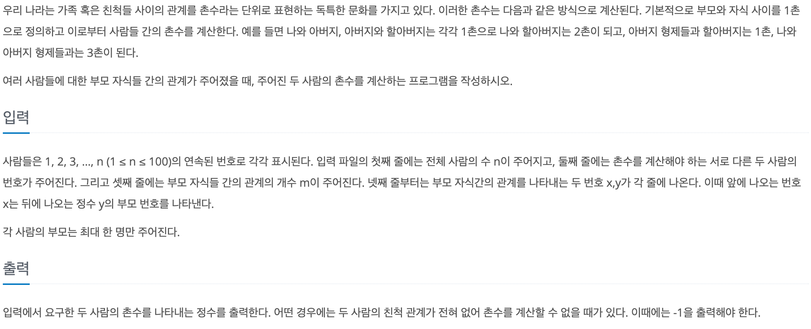

# 촌수 계산

## baekjoon 2644

## 문제



### 풀이
---
촌수를 계산하려면 가족 관계도가 필요하다.

가족 관계도는 보통 그래프 형태로 그려지기 때문에 그래프 형태를 떠올리면서 문제를 풀었다.

graph를 다음과 같이 선언 해주고 입력받은 값을 저장했다.

```
static ArrayList<ArrayList<Integer>> graph = new ArrayList<>();

for (int i = 0; i <= n; i++) {
      graph.add(new ArrayList<>());
    }

    for (int i = 0; i < m; i++) {
      int from = sc.nextInt();
      int to = sc.nextInt();

      graph.get(from).add(to);
      graph.get(to).add(from);

    }

```

dfs를 이용해서 A와 B의 촌수 계산을 해주었다.
```
static void dfs(int A, int B, int count) {
    visited[A] = true;

    if (A == B) {
      result = count;
      return;
    }
    for (int next : graph.get(A)) {
      if (!visited[next])
        dfs(next, B, count + 1);
    }

  }
```


### 코드 
----

```
import java.util.*;

public class 2644 {
  static ArrayList<ArrayList<Integer>> graph = new ArrayList<>();
  static boolean[] visited;
  static int result = -1;

  public static void main(String[] args) {
    Scanner sc = new Scanner(System.in);

    int n = sc.nextInt();
    int A = sc.nextInt();
    int B = sc.nextInt();
    int m = sc.nextInt();
    visited = new boolean[n + 1];
    for (int i = 0; i <= n; i++) {
      graph.add(new ArrayList<>());
    }

    for (int i = 0; i < m; i++) {
      int from = sc.nextInt();
      int to = sc.nextInt();

      graph.get(from).add(to);
      graph.get(to).add(from);

    }
    int count = 0;
    dfs(A, B, count);

    System.out.println(result);

  }

  static void dfs(int A, int B, int count) {
    visited[A] = true;

    if (A == B) {
      result = count;
      return;
    }
    for (int next : graph.get(A)) {
      if (!visited[next])
        dfs(next, B, count + 1);
    }

  }
}
```