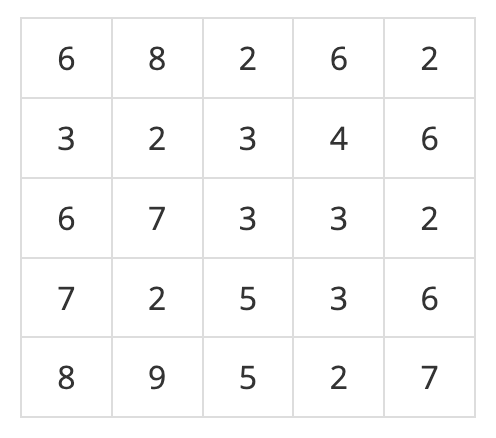
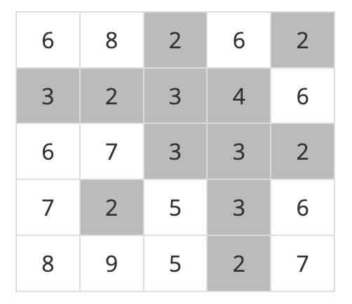
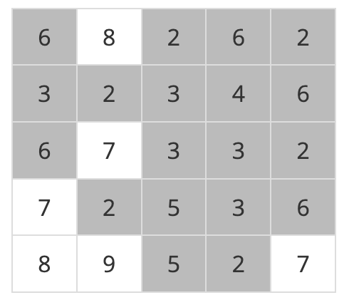

# 안전 영역

## baekjoon 2468

## 문제




비가 내려서 높이가 4이하인 지역이 물에 잠긴 경우



비가 내려서 높이가 6이하인 지역이 물에 잠긴 경우




내리는 비의 양에 따른 모든 경우를 조사해서 안전 영역의 최대를 구해라


### 풀이
---

`dfs`를 이용해서 물에 잠기지 않는 지역을 탐색했다.

상하좌우 4방향을 탐색하면서 `land` 범위 안에 있고 

비의 높이보다 높은 지역을 재귀를 통해서 다음 지역으로 넘어갔다.


```
static int[][] land;
static int[] dx = { -1, 0, 1, 0 };
static int[] dy = { 0, 1, 0, -1 };

static void dfs(int x, int y, int height) {
    visited[x][y] = true;

    for (int i = 0; i < 4; i++) {
      int mx = x + dx[i];
      int my = y + dy[i];

      if (mx >= 0 && mx < N && my >= 0 && my < N) {
        if (!visited[mx][my] && land[mx][my] > height) {
          dfs(mx, my, height);
        }
      }
    }
  }
```
입력받은 지역의 높이의 가장 큰값을 `max`에 저장하고 `for`문을 통해서 모든 강수량의 경우의 수를 탐색하면서,

연결된 지역의 `dfs`가 끝나면 `count++` 해주고 다음 안전 지역에서 `dfs`를 진행했다.

모든 지역에 `dfs`가 끝나면 `safeArea`와 비교해서 최대값을 구했다.


```
int safeArea = 0;
    for (int i = max; i >= 0; i--) {
      visited = new boolean[N][N];
      int count = 0;
      for (int j = 0; j < N; j++) {
        for (int k = 0; k < N; k++) {
          if (!visited[j][k] && land[j][k] > i) {
            dfs(j, k, i);
            count++;
          }
        }
      }
      safeArea = Math.max(count, safeArea);

    }
```

### 코드
---
```
import java.util.*;
import java.io.*;

public class 2468 {
  static int[] dx = { -1, 0, 1, 0 };
  static int[] dy = { 0, 1, 0, -1 };

  static int N;
  static int[][] land;
  static boolean[][] visited;

  public static void main(String[] args) throws IOException {
    BufferedReader br = new BufferedReader(new InputStreamReader(System.in));
    N = Integer.parseInt(br.readLine());
    land = new int[N][N];
    int max = 0;

    for (int i = 0; i < N; i++) {
      StringTokenizer st = new StringTokenizer(br.readLine());
      for (int j = 0; j < N; j++) {
        land[i][j] = Integer.parseInt(st.nextToken());
        max = Math.max(max, land[i][j]);
      }
    }

    int safeArea = 0;
    for (int i = max; i >= 0; i--) {
      visited = new boolean[N][N];
      int count = 0;
      for (int j = 0; j < N; j++) {
        for (int k = 0; k < N; k++) {
          if (!visited[j][k] && land[j][k] > i) {
            dfs(j, k, i);
            count++;
          }
        }
      }
      safeArea = Math.max(count, safeArea);

    }
    System.out.println(safeArea);

  }

  static void dfs(int x, int y, int height) {
    visited[x][y] = true;

    for (int i = 0; i < 4; i++) {
      int mx = x + dx[i];
      int my = y + dy[i];

      if (mx >= 0 && mx < N && my >= 0 && my < N) {
        if (!visited[mx][my] && land[mx][my] > height) {
          dfs(mx, my, height);
        }
      }
    }
  }
}
```