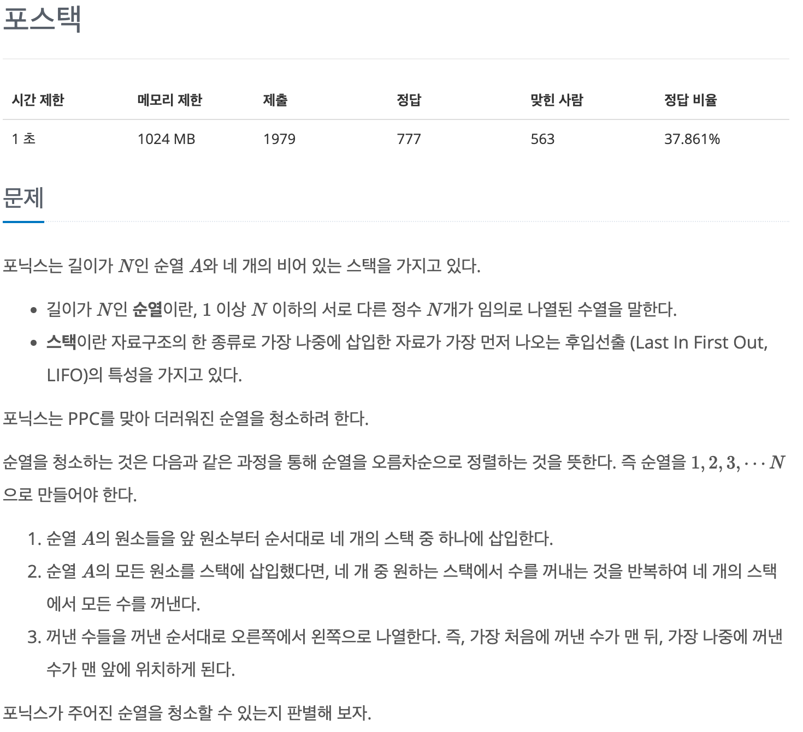
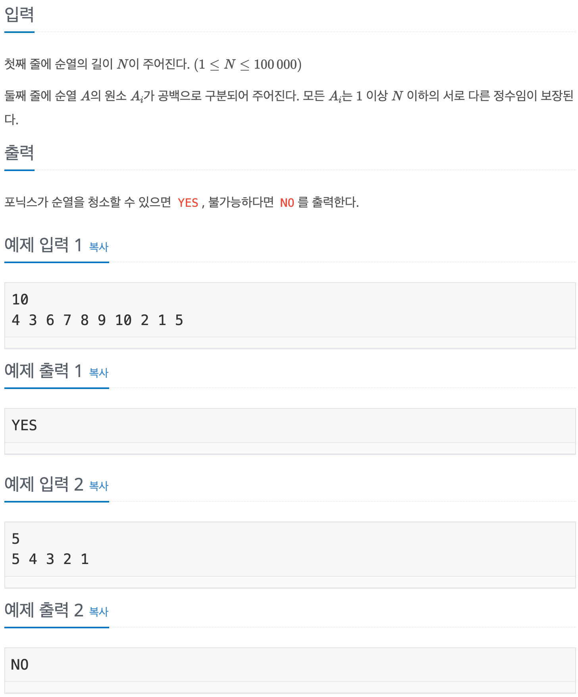

# 포스택

## baekjoon 25556

## 문제





4개의 Stack을 이용해서 순열 A의 모든 원소들을 삽입 한 뒤에

4개의 Stack 중 원하는 Stack에서 수를 꺼내어서 

오른쪽에서 왼쪽으로 나열하여 새로운 순열을 만드는데 이 순열이 오름차순으로 정렬된 형태로 만들수 있으면,

YES를 출력하고 NO를 출력하는게 문제이다

### 풀이
---

Stack 특성상 데이터의 삽입 삭제가 한곳에서 이루어 지기 때문에,

새로 만드는 순열이 오름차순으로 정렬 된 형태로 만들기 위해서는 

처음 순열의 원소들을 4개 Stack에 담는 과정에서 담겨있는 원소들보다 큰 원소만 삽입 되어야 한다.


A|4|3|6|7|8|9|10|2|1|5
|:-:|:-:|:-:|:-:|:-:|:-:|:-:|:-:|:-:|:-:|:-:|

1|2|3|4
|:-:|:-:|:-:|:-:|
||||

A|3|6|7|8|9|10|2|1|5
|:-:|:-:|:-:|:-:|:-:|:-:|:-:|:-:|:-:|:-:|

1|2|3|4
|:-:|:-:|:-:|:-:|
|4|

A|6|7|8|9|10|2|1|5
|:-:|:-:|:-:|:-:|:-:|:-:|:-:|:-:|:-:|

1|2|3|4
|:-:|:-:|:-:|:-:|
|4|3|

A|7|8|9|10|2|1|5
|:-:|:-:|:-:|:-:|:-:|:-:|:-:|:-:|

1|2|3|4
|:-:|:-:|:-:|:-:|
|6|
|4|3|

A|8|9|10|2|1|5
|:-:|:-:|:-:|:-:|:-:|:-:|:-:|

1|2|3|4
|:-:|:-:|:-:|:-:|
|7|
|6|
|4|3|

위와 그림처럼 순열 A의 원소들을 하나씩 4개의 Stack중 하나에 넣는다.

여기서의 조건은 4개의 Stack을 순서대로 탐색하면서, 

비어있으면 삽입하고, Stack안에 데이터가 있으면 Stack의 데이터보다 큰 경우에만 넣는다.

이러한 과정을 거치면 4개의 Stack은 최종적으로는 아래와 같이 된다.


1|2|3|4
|:-:|:-:|:-:|:-:|
|10|
|9|
|8|
|7|
|6|5|
|4|3|2|1|

여기서 데이터를 큰 수 먼저 추출하면 새로 만드는 순열은 오름차순으로 정렬된 형태의 순열이 될 수 있다.

따라서 이 문제의 핵심은 순열 A에서 Stack 4개로 이동 시키는 과정에서 Stack 4개가 모두 정렬된 형태로 

데이터를 삽입 할 수 있으면 YES를 출력하고 그렇지 못하면 NO를 출력하게 된다.


`Stack<Integer>[] stacks = new Stack[4];` 

4개의 Stack을 구현하기 위해서 배열형태로 만들었고, 

```
for(int i = 0; i < 4; i++){
            stacks[i] = new Stack<>();
            stacks[i].push(0);
        }
```

길이가 N인 수열 A가 1 ~ N 까지 수로 이루어져 있기 때문에 모두 0을 넣어서 기준점을 잡아 주었다.

```
for(int i = 0 ; i < n; i++){
            boolean check = false;
                for(int j = 0; j < 4; j++){
                    if(stacks[j].peek() < A[i]){
                        stacks[j].push(A[i]);
                        check = true;
                        break;
                    }
                }
            if(!check){
                System.out.println("NO");
                return;
            }
            
        }
```

외부 for 문은 수열 A의 원소개수 만큼 반복하고

내부 for 문은 Stack 개수 만큼 반복하여 모든 Stack을 순회하면서,

A의 원소가 Stack에 담긴 데이터 보다 클 경우에는 그 Stack에 삽입하고,

그렇지 않으면 다음 Stack에 방문해서 크기 비교를 한다.

모두 비교해서 Stack에 정렬된 형태로 담기지 못하는 데이터가 있을경우에는 `check = false` 바꿔주고 NO를 출력한다.


n개의 데이터를 stack에 옮겨야기 때문에 시간 복잡도는 O(n) 이라고 생각한다.

### 코드
----


```
import java.util.*;

public class 25556{
    public static void main(String[] args){
        Scanner sc = new Scanner(System.in);
        
        int N = sc.nextInt();
        int[] A = new int[N];
        for(int i = 0; i < n; i++){
            A[i] = sc.nextInt();
        }
        
        Stack<Integer>[] stacks = new Stack[4];
        
        for(int i = 0; i < 4; i++){
            stacks[i] = new Stack<>();
            stacks[i].push(0);
        }
        for(int i = 0 ; i < n; i++){
            boolean check = false;
                for(int j = 0; j < 4; j++){
                    if(stacks[j].peek() < A[i]){
                        stacks[j].push(A[i]);
                        check = true;
                        break;
                    }
                }
            if(!check){
                System.out.println("NO");
                return;
            }
            
        }
        System.out.println("YES");
        
        
        
    }
}
```