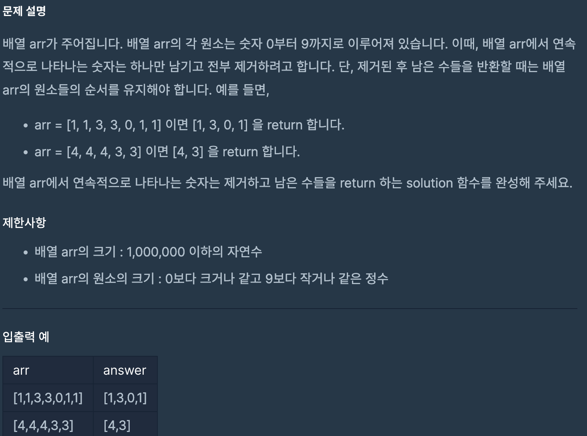

# 같은 숫자는 싫어

## programmers

## 문제



이 문제는 0 ~ 9 로 이루어진 배열 arr에서 

연속적으로 나타나는 숫자는 하나만 남기고 제거하여 

남은 숫자들을 순서대로 반환하는 문제이다.


## 풀이
---

연속적으로 나타나는 숫자를 제거하기 위해서 Stack을 사용했다.

arr의 데이터를 하나씩 stack에 삽입하는데 담긴 데이터를 cur에 저장하여 

다음 데이터를 삽입할때 같은 데이터면 담지 않는다.


이러한 방식으로 arr의 모든 데이터를 stack에 옮기면,

arr의 순서대로 남은 데이터를 반환 해야 하기 때문에 

stack의 size 크기의 새로운 배열 answer를 만들어서

stack에서 추출한 데이터를 answer의 마지막 인덱스부터 채워넣었다.


0 ~ 9 의 수로 이루어져 있기 때문에 

처음에는 `int cur = -1;` 로 선언해서 사용했고

```
for (int i = 0; i < arr.length; i++) {
      if (cur == arr[i]){
        continue;
      }
      stack.push(arr[i]);
      cur = arr[i];
    }
```
전에 삽입한 데이터를 cur에 저장하여 연속하여 나타나는 데이터인지 판별했다.

```
int[] answer = new int[stack.size()];
    for (int j = stack.size() - 1; j >= 0; j--) {
      answer[j] = stack.pop();
    }
```
연속하여 나타나는 데이터를 제거하고 남은 데이터들인 stack 크기 만큼 새로운 배열 answer를 만들어서

마지막 인덱스부터 채워넣었다.

arr의 원소 개수만큼 연속해서 나타나는 수인지 판별하고 

stack에 옮기기 때문에 시간복잡도는 O(n) 이라고 생각한다.

### 코드
---


```
import java.util.*;

public class Solution {
  public int[] solution(int[] arr) {

    int cur = -1;
    Stack<Integer> stack = new Stack<>();
    for (int i = 0; i < arr.length; i++) {
      if (cur == arr[i]){
        continue;
      }
      stack.push(arr[i]);
      cur = arr[i];
    }
    int[] answer = new int[stack.size()];
    for (int j = stack.size() - 1; j >= 0; j--) {
      answer[j] = stack.pop();
    }
    return answer;
  }
}
```