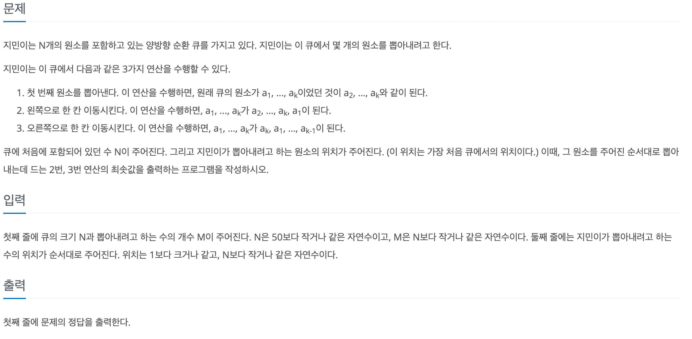
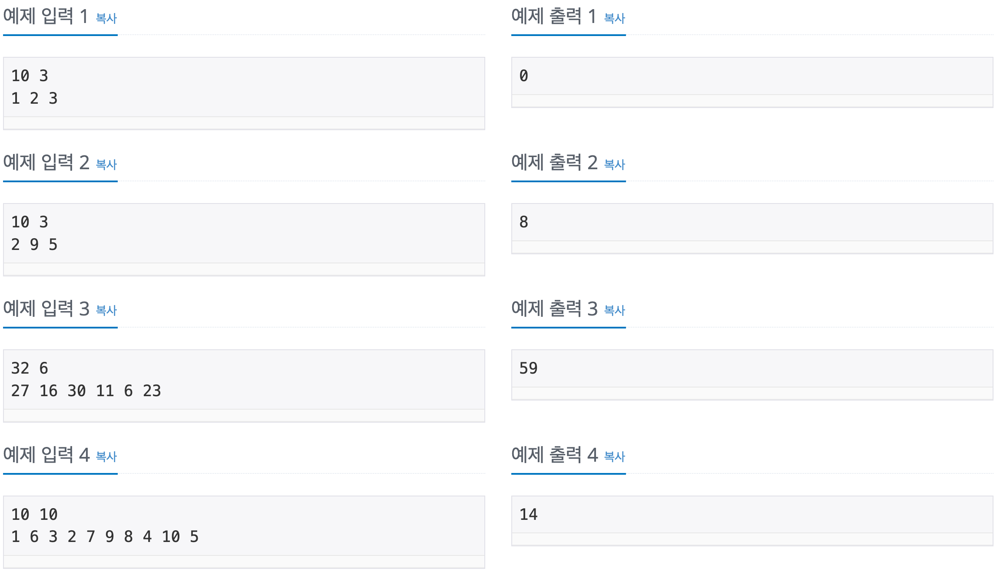

# 포스택

## baekjoon 1021

## 문제






이 문제는 1 ~ N 까지 수가 순서대로 들어 있는 양방향 큐에서 원하는 수를 순서대로 찾기 위해서

3가지의 연산을 수행 하는데 2번 3번 연산을 최소로 하는 횟수를 찾는 문제이다.

연산은 다음과 같다.

1. 큐에서 첫번째 원소를 뽑는다.
2. 큐에서 첫번째 원소를 마지막으로 보낸다 -> 왼쪽 회전
3. 큐에서 마지막 원소를 처음 위치로 보낸다 -> 오른쪽 회전

원하는 수를 뽑는 연산인 1번을 제외한 2번 3번의 연산을 최소로 하기 위해서는 

큐에서 원하는 수를 왼쪽 회전을 하던지 오른쪽 회전을 해서 뽑는 위치인 

큐에서 첫번째 위치로 이동시키는게 목표이다.

따라서 왼쪽 회전 수와 오른쪽 회전 수를 비교해서 더 적은 횟수를 갖는 연산을 실행 시키면 된다.


### 풀이

문제의 이름을 보면 큐를 사용해야 된다고 생각 했지만,

자바에서의 큐는 한쪽에서는 데이터의 삽입이 다른 한쪽에서는 데이터의 추출이 이뤄지는 형태이기 때문에

문제에서 요구하는 양쪽에서 데이터를 추출하고 삽입하는 연산이 불가능하다고 생각했다.

따라서 1,2,3번의 연산이 모두 가능한 자료구조인 LinkedList를 이용 해서 문제를 풀었다.

```
LinkedList<Integer> q = new LinkedList<>();

    for (int i = 1; i <= N; i++) {
      q.add(i);
    }
```

LinkedList에 순서대로 수를 넣어주었고 

원하는 수를 입력 받은 find[]의 수들을 모두 찾아주기 위해 for문을 이용했다.

순서대로 찾아주는 것이 문제에서 요구하는 것이기 때문에 target에 저장하여 

que에서의 index를 찾아주고 왼쪽 회전 수와 오른쪽 회전수를 비교해서 최소값을 찾아 주었고 그 횟수를 count에 더해주었다.


```
int count = 0;
for (int i = 0; i < M; i++) {
      int target = find[i];

      int idx = que.indexOf(target);

      int rotateLeft = idx;
      int rotateRight = que.size() - idx;
      int min = Math.min(rotateLeft, rotateRight);
      count += min;

    ...      
```

2,3번 연산중 최소한의 연산방법이 정해지면, while문을 통해서 횟수만큼 연산을 해준다음

1번 연산을 해주면서 target을 뽑는 연산을 최소한의 횟수로 수행했다.

```
while (min > 0) {
        if (rotateLeft <= rotateRight) {
          int data = que.removeFirst();
          que.addLast(data);
        } else {
          int data = que.removeLast();
          que.addFirst(data);
        }
        min--;
      }

que.removeFirst();
```

왼쪽 회전은 처음 원소를 뽑아서 마지막 위치로 보내주고

오른쪽 회전은 마지막 원소를 뽑아서 처음 위치로 보내주는 방식을 최소 연산횟수만큼 반복했다.


### 코드
---

```
import java.util.*;

public class 1021 {
  public static void main(String[] args) {
    Scanner sc = new Scanner(System.in);
    int N = sc.nextInt();
    int M = sc.nextInt();
    int[] find = new int[M];
    for (int i = 0; i < M; i++) {
      find[i] = sc.nextInt();
    }
    LinkedList<Integer> que = new LinkedList<>();

    for (int i = 1; i <= N; i++) {
      que.add(i);
    }

    int count = 0;

    for (int i = 0; i < M; i++) {
      int target = find[i];

      int idx = que.indexOf(target);

      int rotateLeft = idx;
      int rotateRight = que.size() - idx;
      int min = Math.min(rotateLeft, rotateRight);

      count += min;

      while (min > 0) {
        if (rotateLeft <= rotateRight) {
          int data = que.removeFirst();
          que.addLast(data);
        } else {
          int data = que.removeLast();
          que.addFirst(data);
        }
        min--;
      }
      que.removeFirst();
    }
    System.out.println(count);

  }
}
```