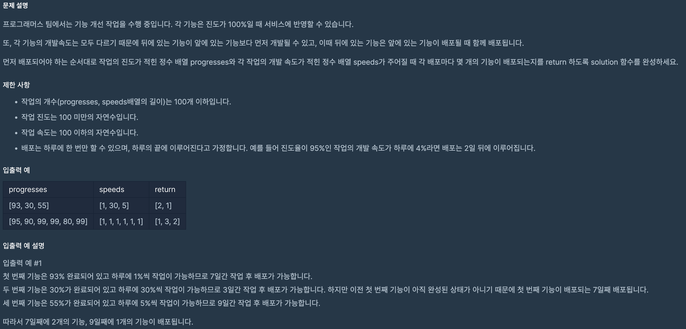

# 기능개발

## programmers

## 문제



이 문제는 작업의 순서가 정해진 형태로 작업들의 진도와 속도가 주어지는데

순서대로 진도가 100이 되면 배포를 하게된다.

배포가 진행되면 다른 작업 진도가 100인 작업도 같이 배포가 되는 형태인데,

배포가 진행될 때 마다 몇 개의 작업이 배포되는지 구하는 문제이다.

### 풀이

문제에서 작업의 진도와 속도가 배열 형태로 주어졌기 때문에 

작업의 순서대로 배포하기 위해서 작업의 배열의 인덱스를 Queue에 저장했다.

```
Queue<Integer> q = new LinkedList<>();
    for (int i = 0; i < progresses.length; i++) {
      q.add(i);
    }
```

Queue는 자료구조 특성에 따른 한 쪽에서만 데이터의 추출이 가능하다.

따라서 진도가 100이 넘었다 하더라도 앞에 작업이 완료가 되지 않으면 추출 할 수 없다.

그래서 맨 처음 작업의 진도가 100이 될 때 까지 진도에 속도를 더해서 작업이 완료 되면,

배포하게 되는데 진도가 100인 작업을 모두 배포하는게 앞에 작업의 진도가 100인 작업들만 배포하게끔 했다.


```
while (!q.isEmpty()) {
      int count = 0;
      while (!q.isEmpty() && progresses[(int) q.peek()] >= 100) {
        q.poll();
        count++;
      }
      if (count > 0) {
        al.add(count);
      } else {
        for (int i = 0; i < progresses.length; i++) {
          progresses[i] += speeds[i];
        }
      }
    }
```

작업은 모두 진행해야 하므로 Queue에 저장된 작업이 모두 완료 될 때 까지 반복문을 돌면서

한 번의 배포가 이뤄 질때는 조건에 맞는 작업을 추출하면서 count++ 해주어서 수를 계산했다. 


### 코드
---

```
import java.util.*;

class Solution {
  public int[] solution(int[] progresses, int[] speeds) {

    ArrayList<Integer> al = new ArrayList<>();

    Queue<Integer> q = new LinkedList<>();
    for (int i = 0; i < progresses.length; i++) {
      q.add(i);
    }

    while (!q.isEmpty()) {
      int count = 0;
      while (!q.isEmpty() && progresses[(int) q.peek()] >= 100) {
        q.poll();
        count++;
      }
      if (count > 0) {
        al.add(count);
      } else {
        for (int i = 0; i < progresses.length; i++) {
          progresses[i] += speeds[i];
        }
      }
    }

    int[] answer = new int[al.size()];

    for (int i = 0; i < answer.length; i++) {
      answer[i] = al.get(i);
    }

    return answer;
  }
}
```